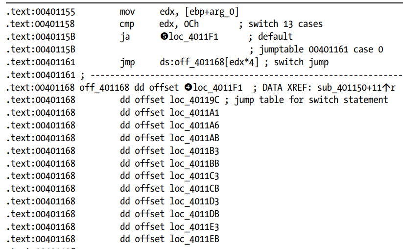
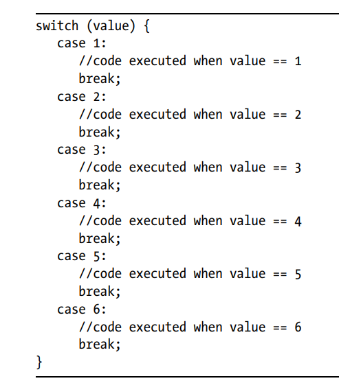
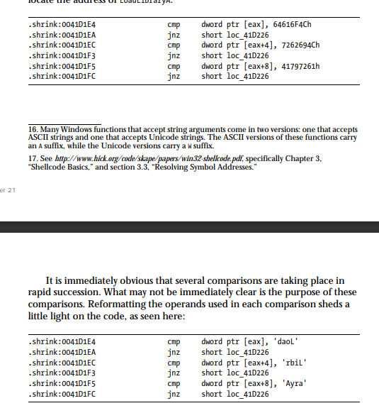
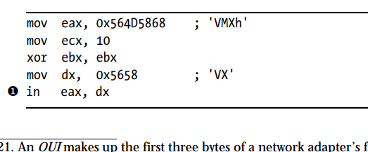
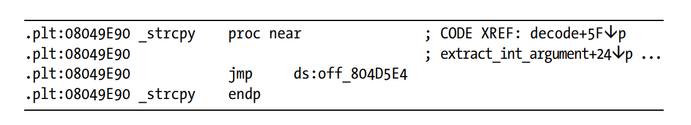
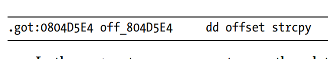
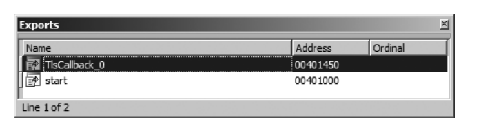
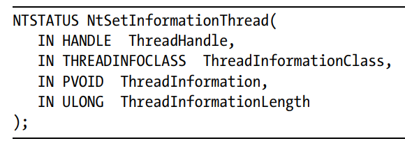
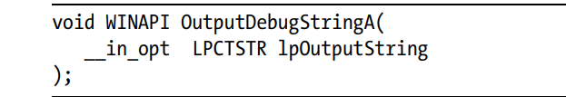

# IDAPRO
#### This is a collection of some features of IDA Pro and its important plugins referenced from the book `The IDA Pro Book by Chris Eagle`: 

### How does a disassembler works?

- identifying the entry point of the code snippet
- matching the binary opcode into the found assembly instruction
- Two methods are linear sweep and recursive descent

    - The linear sweep method treats all the instructions as machine unstrns and proceeds the program code by converting them to the assembly instrns and as it does this linearly, it cannot refer to any address table given in the instrns pointers and treat them too as intstrns that are wrongly converted to the instrns.

    - `loopne` instruction is most probably an error encountered by the disassembler while disassembling the program.

    - Recursive Descent
        - It disasssembles the instrns on the basis whether they are referenced by other instrns or not.

        - For easy instrns like `add` , `mul` the disassembler uses the sequence flow and use the linear sweep method.

        - when the jump statements are encountered then both paths are disassembled by the disassembler.

        - both the disassembler fails when they are required to disassemble the isntructions after returning from the functions due to the shifting of the stack.

        - It can easily differentiate between the code and the data as it is chossing the code snippet first and then disassembling it.

### Internals of Files inside IDA 

`EXE: MZ( 0x5A 0x4D)`

- stripping the binary removes the `symbols form the EXE file.
- `nm` is used for listing symbols inside the stripped files.
- `ldd` lists the dynamic linking libraries of the binary file.
- `dumpbin` can be used to list the dependencies of the binary file inside Windows.
- `c++filt` for cpp name demangling inside the c++ program. It can give the decompiled version names of all the functions.
- `ndisasm` tool to disassemble the binary file


### Working of IDA

- When an instance of IDA is launched then the UDP packet is sent to the port `23945` in order to 
- IDA searches for the `ida.key` file and checks if it is valid.
- `.id0, .id1, .nam, and .til` are the database extensions of the IDA binary disassembly. They store the addresses and other contents in form of a B-Tree.
- Pack Database(Store): This option takes the four database files and pack them into one.
- Pack(Deflate): This option also deflates the files and then stores them into one packed database file.
- `Group Nodes` is for grouping or basically shrinking the nodes into the instructions that are necessary only.
- `Hex View` can be converted into the `Hex Edit` format that can be used to edit the bytes of the binary file directly.
- `Exports` window contains the file entry points to any address.
- `bss` section caontains all the uninitialized variables and data and also the static variables
- Exports ordinals make the addressing of the functions easier and faster as every function is then accessed as a pointer rather than a variable.
- Imports section is the table section that contains the addresses of the libraries and the imports that have been loaded by the binary file.
- `The Structures` window tells us about all the structs and the unions of IDA program it is similar to `The Enum` window.
- `The Names` window shows the Global names of the binary inside IDA.
- `F`: function, `L`: Library function, `I`: Import, `C`: Named code(they are not related to any function as considered by IDA), `D`: Data, `A`: String data.
- `The Signatures` window lists the standard signatures of the executable file. This differentiates the library std functions.
- `The Function Calls` graph Window gives is the graphs drawing of the function calls and references.
- `_cdecl` is the modifer for the c compilers that force the compilers to use the C calling convention.
- Fastcall convention for x86: `ECX -> EDX`
- thiscall calling convention: `ECX` register is passed to the first (Visual C++)
- In x86 systems, the `EBP` register is used for the stack frame pointer.
- To make the frame pointer allocation independent we can use flags while compilation : `-fomit-frame-pointer`.
- IDA does'nt generate names of those local variables that are not directly referenced inside the functions.
- Generally the first argument given `arg_0` is empty and nothing at all.
- Registers can also be renamed inside a scope.
- <BAD> marks are inside the program code to resemble the instructions that are not recognized by some assemblers.
- Functions can also be deleted.
- `U`: Undefine converts the code into raw data while `C`: Code converts the raw bytes into code.
- `A` is used for ASCII conversion.
- `Y` can be used to change the declaration type of the function. This is necessary as this will change the types of the arguments too.
- Global arrays elements appear as global variables. In this case the variables index values and their addresses can only shift us to the start of the array.
- Stack alloctaed arrays appear as arrays stored on stacks very clearly.
- Heap allocated arrays are treated as pointers and then the address of the first element is stored in some variable and handled like that.
- Structures size generally should be equal to the sum of the bytes of the data types or fields it has but actually the compiler pads the bytes and do not give minimum space to the datatypes of fields. It makes sure that they are writable and readable easily.
- Globally allocated structures: Their addresses is known at the compile time





- The above image shows a global array with its various fields. This looks like global variables but they are different from globally allocated arrays as they doesnot include the opeartions between the pointers' addresses.
- The union size is the size of the largest element field type in the union while for the structure the size os the sum of all fields.
- `Local Types` is used to insert new structures or unions that are not  identified by IDA.
### TIL files of IDA    

- All datatype and fucntion prototype information is stored in TIL files
- If an address is moved into the `ECX` register just prior to the function call then it is generally be compiled using Visual C++ and also the function is a member function or part of s struct or class.

### Virtual Functions and Vtables
- They are the standard tables of the classes that are used to store the pointers of the Virtual functions.
- Every class has an additional data member that stores the address of the vtable at runtime.{vtable pointer}. It is the first data member within the class.
- The subclass introduced does'nt have any vtable of its own but it has to inherit the vtable of the BaseClass 



- If the SubClass doesn't override the implementation of the BaseClass virtual functions then the SubClass inherits the same virtual functions and the same vtable pointers to the functions as the BaseClass.
- The virtual functions are called using the registers pointers to the functions as `call eax` will be executed after storing the address of the virtual function inside the `eax` register.
- SuperClass is the reference to the methods and the variables of the parentclass having the same name as in the child or the SubClasses. This resolves the ambiguity of the names of the methods and their required parameters among both classes.
- Constructors dono treturn anything. But the constructors generated by Microsoft Visual C++ return `this` in the `EAX` register.
- Destructors are called only after the main function terminates.
- As soon as the objects go out of scope , which were allocate on the stack , the destructors for the corresponding objects are called.
- Destructors for heap allocated memory objects are called using `delete` operator.


### Name mangling in languages
- This is used by compilers to disinguish between the overloaded versions of many fucntions.
- Demangling is done by `Options->Demangled Names`.



- The type of the pointer is `concrete_class` as the object of type concrete_class is made inside the main function. The compiler stores a different pointer at beginning of the vtable that points to the name and details of the class and thus it is used to retrieve the information of the class to which the object belongs.
- Inline functions are not treated as regular function calls and they initialize the constructors within the class themselves.

### Determining the Inheritance Relationships

-  When two vtables contain the same number of entries, the two corresponding classes may be involved in an inheritance relationship.

- When the vtable for class X contains more entries than the vtable for
class Y, class X may be a subclass of class Y.

- When the vtable for class X contains entries that are also found in the
vtable for class Y, then one of the following relationships must exist: X is a subclass of Y, Y is a subclass of X, or X and Y are both subclasses of a common superclass Z.

- When the vtable for class X contains entries that are also found in the
vtable for class Y and the vtable for class X contains at least one purecall entry that is not also present in the corresponding vtable entry for class Y, then class Y is a subclass of class X.

### Cross Referencing

- This is done using the directed graphs that help us to acknowledge which vertex is called by which vertex in the node graph.
- If a variable is `reading` the program memory then `r` suffix is used else `w` suffix is used for `writing` into the program memory by the cross-referenced memory and `o` is being used for references or pointers.
- Subview `Function Calls` can be used to see the called functions inside a function or the callers of that function.

### Many faces of IDA
- `ENTER` key opens the stack subview of the function selected by the cursor.


### Advanced usage of IDA   
- ida.cfg file can be used and customized in order to make the IDA GUI more fashionable and user friendly.
- For ida GUI configuration we have to modify the file `idagui.cfg`.
- `DISPLAY_COMMAND_LINE` is used to control the display of the bottom box that inputs one lione scripts in IDA.

### Avoiding library standard functions
- Execution of the program starts from `_start` always and not `_main`.
- In C++, the constructors for global declared objects are called prior to the execution of main function.
- IDA uses signature of some standard known functions to name some of their arguments and their resulting return values of the functions.
- IDA sometimes male mistakes while calculating the bytes purged by a function or the bytes that a function uses to store its result.
- The `auto comments` feature gives is the meaning of each assembly instrn in front of the instrn in the form of a comment.

### Patching
- `Produce file` option can be easily used to produce any type of different extension using the given binary file.
- The `Change byte` option is to change the 16-bytes starting from the address specified by the cursor.
- The `Change Word` option is to change the 2-bytes word starting from the cursor at once and no more.
- As the assembly option is used to change or patch the instrns in IDA , it tries to overwrite the instrns if the reqd new instrn is longer in size than the instrn that is shorter else if the i=new reqd instrn has shorter size then the remaining size is possibly filled with NOPs.


### IDA Scripting
- Declare the variables in IDC using `auto` prefix.
- Declare the global variables using `extern`.
- `strcpy` function copies the string into the stack and `strdup` function copies the string into the heap.

```
if (1) { //always true
 auto x;
 x = 10;
}
else { //never executes
 auto y;
 y = 3;
}
Message("x = %d\n", x); // x remains accessible after its block terminates
Message("y = %d\n", y);
```

- In this code snippet , the x remains accessible after the if-else statement too because of the IDCs scoping rules, that makes theb x variable global scope  as it is declared using `auto` keyword.

- `static` is used to declare the user-defined functions like: 

```
static my_func(x,y,&z){}
```

- `&` unary operator is used to denote reference of the variable passed as an argument.
- `return` is used to return the value.
- Adding hotkey to the IDC script: `AddHotKey("<HotKey>","Function_to_execute")`

#### Important Functions:

- `long Byte`reads a byte value from the virtual address.

```
Message(Byte(0x0000000000001598))
```

- `long Word` reads a word (2-byte) from the virtual address.
Execution: Similar to Byte() function.

- `long Dword` reads the 4-byte from the virtual address.
Execution: Similar to Byte() function.

- `void PatchByte(addr,byte)` function patches the byte at the specified address of the code.
Execution: `PatchByte(0x0001598,90)`

- `bool isLoaded` function returns true if the address is perfectly loaded into the program disassembly.

- `Message` function is the fn that prints the desired string.

- `print` function is for multiple arguments: `print("hello","world")`

- `AskStr` asks for the input from user using a dialog input textbox.

- `ScreenEA()` function returns the value of the current address.

- `Warning` function makes a dialog box that returns the string warning in it .

- `AskFile` is similar to the `AskStr` function but it just asks for the name of the file instead of the string only.

- `Jump` function jumps the cursor window to the specified address. `Jump(0x000000000000126A)`.


#### String Manipulation functions

- `form` function stores the string into formatted format like in the form of `%d` of the string.
- `atol` function gives us the integer parsed out of the string supplied to the function

#### Function handling functions

- `GetFunctionName` function returns the name of the function that contains the address specified.
Execution: `Message(GetFunctionName(0x00002199))`

- `NextFunction` gives the next function to the current function. `PrevFunction` is also there.

#### Code References

#### Database Manipulation Functions

- `MakeCode(addr)` function makes the specified bytes at the given address into the instructions.

- `MakeComm(addr,comment)` function adds  the comment to the given address

- `MakeFunction(begin,end)` function makes the specified bytes or isntrns from the given address to the given address as a function.

- `FindCode(addr,flags)` searches for an instrn inside the code from the starting of the given address. `FindData` searched for the data.

```
The flags here are : SEARCH_NEXT, SEARCH_DOWN,SEARCH_CASE.
```
- `FindBinary(addr,flags,binary_string)` function searched the sequence of bytes from the given address.

- `FindText(addr,flags,row,column,text)` searches in the given col and row and in the given address.

#### Disassembly functions

- `GetDisasm(addr)` function gets the disassembly of the given address.
- `GetMnem(addr)` gets the mnemonics for the given address.
- `GetOpnd(addr,op_num)` gets the op_num index of the operand specified at the given address.
- `GetOpType(addr,op_num)` gets the operand at the given address.

```
strcpy() function does'nt check the length of the destination address buffer and just copies the source buffer to the destination buffer that may result in the vulnerabilities in security like buffer overflow.
```

- `get_screen_ea()` command returns us the address at which the cursor of the program is in IDA.

- `jumpto(addr)` is used to jump to any address using the cursor.

- `get_name(from_addr,incl_addr,output_buf,max_cnt)` is the function that gets us the name of a particular address inside the function  or closure that starts from the address `from`.

- `get_func(addr)` returns the pointer to the function that is in the particular given address.


### The Magic bytes

- The PE file has the magic byte `5A 4D` as its magic bytes at the beginning.

- The offset `0x3c` tells us about the PE header of the file.

- The `AddressOfEntryPoint` is the address of the base virtual address starting of the executable file.

- The `.bss` section contains all the globally assigned variables that are initialized to zero when the program executes

### Python Reversing

- The interpreter has no registers other than the `Instructions Pointer` and the `Stack Pointer`.

- `BINARY_ADD` isntrn adds the top two things of the stack and removes them from the stack adding the result at the top again in the stack.


## Handling of Various Binaries

- The `Switch` statement:


- Here the default case and the other cases to be executed are shown by IDA.

### Analysing Obfuscated Code

- Jump in the Middle Obfuscation:
    - In this an instrn is like this that it jumps the RIP to the middle of an existing instruction that makes it harder for IDA to disassemble it.
    - It can be corrected by undefining the code snippet and making it again correct using the `Analyze` option on the bytes.
    
    - Analysis: Make the bytes undefined where the call instrn jumps and then define the instrn at call target address to get the analysed code of the remaining bytes.

    - The `jmp` isntrn can also be used for the same thing but it has to be skipped to be able to analyse.

- Jumping to the Dynamic Addresses
    - What if the program tends to jump to the address which is then stored into the `EAX` or some other register. This requires only dynamic debuggin gin order to overcome it and compute the dynamic loaded address in the registwers or the stack at that point.
- One method of breakpoint addition is the addition of `int 0xcc` into the bytes of the file.
- Opcode Obfuscation
    - It encodes or encryptes the actual data or functions of the executable file which are decrypted in runtime and thus it is not able to be detected statically.
    - If we use the virtual machine engine to compile the code then it will not execute the code directly but will appear as bytecode that iwll get executed. {VMProtect is also like this}.
    - `QuickUnpack` is one of the famous deobfuscator in Windows.
    - When the executable is packed with an obfuscator then they will appear to have some random data inside the analysed bar that will get into the analysed part by the decompression stub.
    - Windows APIs are used using the function `LoadLibraryA` in order to call a function inside any standard DLL file by getting the address of the file using `GetProcAddress` that can be called during runtime.


    Above is the Obfuscation for calling the LoadLibrary function inside the program code.

#### Anti Dynamic Analysis Techniques

- Detection of Virtualization:
    - Virtual machines are assigned their own OUIs (Organizationally Unique Identifiers) to use the network adapters virtually.
    


- This identifies the VMWare if the system is working on it . If EBX = 0x564D5868 after the function return value then 

- The `redpill` is also a VM detection technique like this but it uses the processor based information to decide whether it is a function for read/write.

#### Attaching a Debugger
- PTRACE can be used to attach to only one process at a time thus no other process can attach now to the process being debugged and also with this , the process who becomes the father process using ptrace can now be not attached or debugged by any othe rprocess too.

#### Static Deobfuscation

```
rdtsc instruction checks for the internal time stamp counter that checks if the program has been stopped while execution. It returns the ticks since the processor was last reset. The debuggers cannot stop the rdtsc timer to increment and thus we can easily determine the time for which program has been stopped as the time between two consecutive rdtsc instructions.
```

#### Virtual Machine Based Obfuscation
- It is basically a representation if a bytecode instead of a set of instructions.

- plt entry table for functions



- got entry for functions



- The calling of shellcode instructions using the registers and the `call` or `jmp` instructions is called `trampoline` that also jumps at different locations within the addresses that contain the bytes of the shellcode.


#### Important Plugins

- Class Informer: It is like OOAnalyzer and may help in analysing the binary classes, methods , inheritances as well as the vftables and the virtual functions.
- MyNav: It is useful in comparing the paths leading to or from a function as xref or leading cause.

## The IDA Debugger

- Tracing
    - There are 2 types of tracing : Function and Instruction Tracing
    - Instruction Tracing:
        - It slows down the debugger as IDA has to record all the instrns as well as the values of registers and the addresses.
    - Function Tracing:
        - It is to trace the function calls inside a program and trace what function calls or get called by any function.
        - No register values are logged inside the Function tracing.
- OEP Address:
    - Original Entry Point address is the address where the execution of the debugger starts actually.
- TLS Callbacks
    - These are the callback functions that are called using the `.data` segment before the `_start` function 

   

    - This is how the TLS_Callback functions look like inside IDA.

    ```
    In Windows, RtlUserThreadStart is the function inside ntdll.dll that is called at every start of the program.
    Stop on debugging start option in IDA stops here.
    ```
- Options of IDA debugger
    - Stop on process Entry Point
        - This stops at the `start` function symbol.
    - Stop on thread start
        - This must stop in any instruction inside the `kernel32.dll`.
    - Stop on debugging message 
        - This stops on the function call of `OutputDebugString` inside IDA.
- Import Table Reconstruction

### Anti-Debug Techniques
- PEB Fields
    - `isDebugged` and `IsDebuggerPresent` are the fields that tell us if the file is being debugged or not.
    - `NtGlobalFlags` is the field that is at the offset -> `peb + 0x68`. It is set to 1 if the program is being debugged.
    - `NtQueryInformationProcess` is the field in `ntdll.dll` . If the process is being debugged then the result is non-zero. `ProcessInformationClass` and `ProcessDebugPort` are the constants that provide us the details about this.
    - `NtSetInformationThread` structure is used to modify the features of a thread `ThreadHideFromDebugger` option moves its value into the `ThreadInformationClass` whose value is tested to bypass the function body.

  

    - `OutputDebugStringA` function:
        - It returns 1 when no debugger is attached else it will return the address of the parameter string if the debugger is attached to the process.

  

```
IDAStealth plugin employs some common techniques for anti-debugging techniques and bypass them automatically.
```
- We can easily change the Exception calls and modify them to execute any address or shellcode using IDA.

### Additional features of IDA
- In remote debugging the host computer system is the system on which the debugging will be done 
- `Appcall` feature can be used to call any function included inside the executable that can be used inside IDAPython to to write decryption scripts expecially in the case of Ransomwares.


    
     


