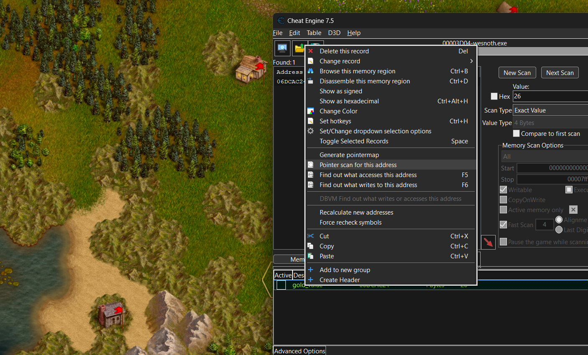

--- 
  title: "Game Reversing: Ch2"
  date: 2024-0527 00:00:00  +0800
  categories: Reverse Engineering
  tags: [ReverseEngineering]
---


## Dynamic Memory Allocation

#### We did find the address of available gold stored with the user, but is it the same address everytime??

The answer is NO due to DMA (Dynamic Memory Allocation) . This is the system or security mechanism used by most of the games or programs including the game `Battle For Wesnoth` to randomize the system addresses including the function addresses inside the program to make it difficult for the attacker to modify the variables and the functions of the game program 

### Gold Never Decreases

- This can be done easily using the Cheat Engine which remembers the current value of any variable stored inside the game's memory and then set it to this value everytime the game tries to change the value of this variable.


- We can also activate the limiter here where the `green arrow` allows the value to increase only and `red arrow` only allow the value to be increased.

```
Also we can use the pointer mapping technique to ensure that we donot have to scan for the variable values again and again as the address of the variable changes due to ASLR enabled inside the game memmory.
```
- Generating a pointer map:
 
 

    Just choose the variable which you want the pointer map for and plac it in the same directory as the game and then everytime w open the game the variable will be mapped automatically.

- Finding the variable inside the code:

    - Now to make the gold actually never decrease we have one more method to do so. By patching the code of the game as there must be some instruction that is decreasing the `gold_remaining` variable stored.

    - For this we will use the Cheat Engine, we have to go to `gold_remaining->find_out_what_accesses_this_address`. 

    - Here we can see all the instructions that will try to access the address where our variable is stored as the game is running side-by-side.

    - Now try to spend some gold inside the game and observe the instructions window.

    

    - Here we can easily see which instruction is accessing the address and how many times.

    - The `sub [edx+04],eax` instruction is the only subtract instruction which is accessing the address and thus it must be the instruction responsible for the gold to decrease when it is spent inside the game.

    

    - We can double click on the instruction to get more info about the state of the game there at that instruction like its register values.

    - We can make this address offset saved inside the Cheat Engine memory by going to `Advanced Options` and saving the address of the `gold` with some random name.

    

    - This saves the offset of the address instead of the absolute address which is relative to the game's base address. Thus this makes sure that if we restart the game again we can easily trace the same instruction again no matter at what address it is inside the game memory.

    - We can also `nop` out the instruction here to freeze the `gold` variable.

    

    - Or we can use another debugger like IDA Pro to do this.

##### Attaching the Debugger
- Attach the debugger 
    - Now we will attach the `IDA Pro`debugger to the Game and search the address of the same instruction and patch it to a `nop` sled instructions.

    

    - In x32dbg
    
    

```
The code appears in instructions dynamically in IDA Pro however in x32dbg disassembler, the instructions appear as they are executed. So it is much preferred to use x32dbg in attach mode than IDA.
```

#### Creating Hotkeys using the Cheat engine

- Here we will be making a cheat or simply a hotkey to increase our gold by 100 everytime the hotkey is pressed.

- Now right click the desired address and goto `Set Hotkeys`.


- Choose the option `Increase value with: 100`. Here we can also make the address get a certain value or decrease the value at the particular address.
Also choose your hotkey that must not be the key to execute any other function inside the game.Also sound activation can be made alongside with the hotkey activation.

- Now everytime I press the chosen hotkey, the gold will increase its value by 10.

### Defeating the DMA of the game


- In most of the games we have dynamic addresses that does'nt allow us to have the desired addresses as we restart the game but generally the address of various variables and entities are mapped according to the base address of the game and thus as we know the offset of the game we can know the exact address of the game even after restarting the game.

- For this we will use `Pointer mapping` feature of the Cheat Engine:



- Just generate a pointer map using `Generate Pointer Map` for the address we have for the `gold` variable and save it inside any directory.

- Cheat Engine by default stores the address of all instructions relative to the base address of the game. Thus for calculating the address of the variable we need to store the instructions accessing the variable address in any way.

```
It is good practice to get 2 or more instructions for each variable mapping as the base address might be calculated wrong sometimes.
```

- As we see the instructions that are accessing the `gold` variable , we can observe that the gold is actually located somewhere at the offset `0x4` of a struct inside the game code.


- Here I added the addresses of 2 instructions that are reading and writing to the address of the `gold` variable, into the codelist.


- Now I will restart the game as then the addresses will get randomized. As you will see our saved address no longer stores the value of `gold`.

- Go to `Advanced Options` and select one of the address and `Find the addresses the code writes to` for that instruction and try to spend some gold inside the game.


- This shows that the code has just written to a particular area of code and thus this is the new address of our `gold`.

- We can also check this through value scanning of Cheat Engine.


- Most of the times this mapping takes a lot of instructions and a lot of time for scanning. Thus, it is not recommended to use this technique for pointer scanning

### Comparing the Pointer Maps

- This is generally done after doing the above method. As the above method can generate flase results we have to check for the right address of the variables.
- This is another way to calculate the exact address of the variable i.e by comparing the pointer maps of the new and the old variable address as the obtained address of the variable might be wrong.
- Thus Go to `Pointer Scan` for the variable and compare it with the new variable address obtained.

```
Ensure that the types of the variables is same as which we can easily see and decipher.
Also the addresses ending with 2 and 6 are not 32-bit aligned so it has to be disabled for the addresses of the variables which end with these digits.
```

- If we get a long list of addresses, then we can also filter them according to the `offset` of the variable address like we have the offset `0x4` for the `gold` value.


- Start comparing the `new gold value` pointer map to the `old gold value` pointer map and observe all the addresses.

- This can also be used actually for various offsets calculation of all the entities in the same struct or class as the `gold` variable.


- The `offset 6` here is the last offset of the address and can be understood as the offset mentioned in the instruction: `sub [edx + 04] eax`. We can filter this by using `Pointer scanner` option and adding the offset to the new address to get some lesser and filtered results.


