## AutoBot

Today we are going to reverse and analyze a malware executable based for Windows OS and try to understand the basic techniques adopted by modern malwares and what malicious thing it does and how it does it exactly. So let's get started:

```
Hashes:

MD5:    37F25C892B3BE599C16155A67935FD3B
SHA256: 3BD36350A0ADC75F5F7615C68CD7F1749A4855FFF3CF245418D83CA567812031
```

#### Basic introduction

- Before starting our analysis, we will get a basic idea of the executable using DIE and Virus Total.com results:

###### DIE analysis

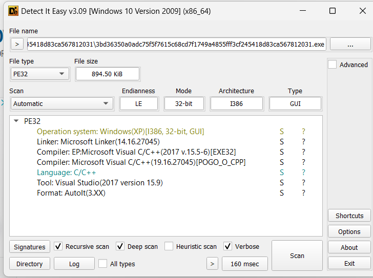

- DIE immediately tells us that the executable may be an AutoIt script executable that generally executes an autoit script that is malicious.

###### VirusTotal.com

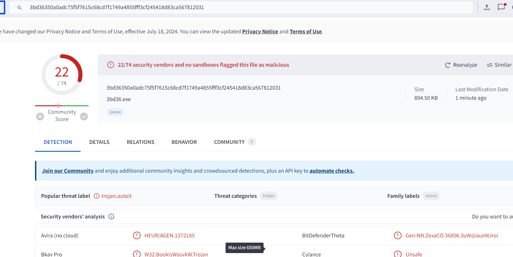

- VirusTotal also marks the executable as a malware with 22 out of 74 AV engines.

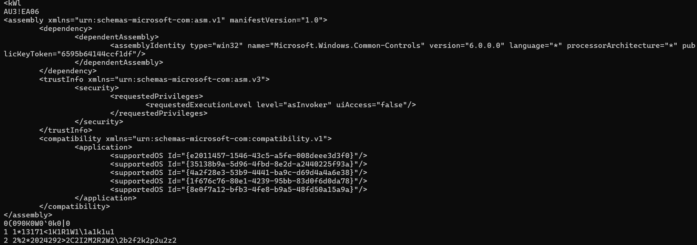

- Looking at the strings of the executable we find `AU3` keyword here that might be pointing to an autoit script.

#### Static Analysis

- We will do the static analysis of the executable inside the IDA free 8.4 version due to its good decompilation feature.

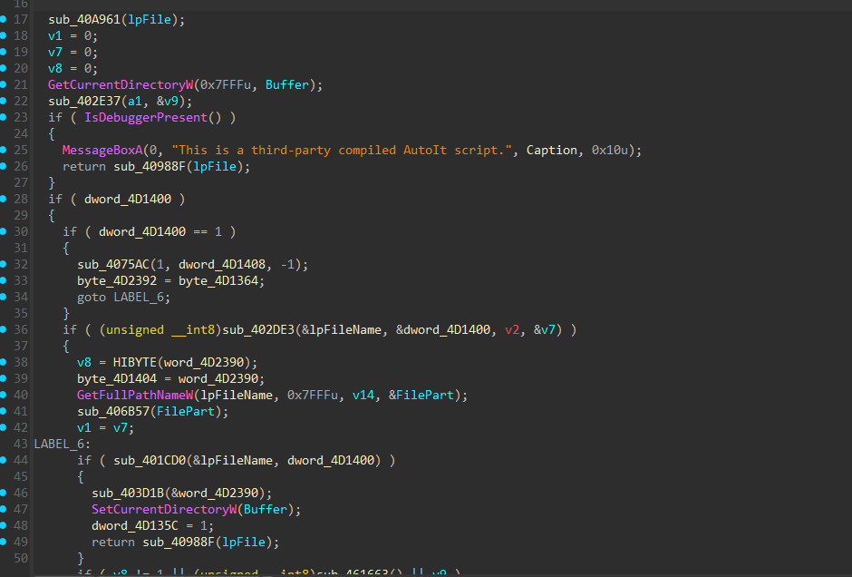

- The decompilation proves our point, the executable is actually an AutoIt script executable that runs the autoit script once it is loaded into the system process.

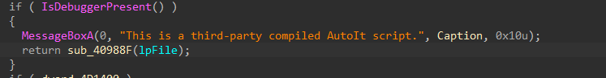

- The malware uses the ``IsDebuggerPresent(` export function of Win API to detect if the program is being debugged. And if the debugger is detected then it does'nt do anything suspicious and call `HeapFree` function to ready to exit the process. This is used to not show the malware analysts the real actions of the script.

- To fix this we can just patch `IsDebuggerPresent` or just change `jnz` instruction to `jz` so that we jump top the right place when debugging.

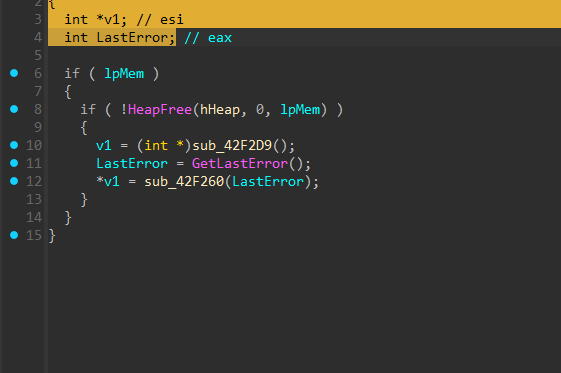

- For further analysis we will extract the AutoIt script using the tool `AutoIt-ripper` that can be installed simply by `pip install autoit-ripper`.

- Execute the command `autoit-ripper <file.exe> <dir_name>` to get the autoit script inside the directory out of the executable.

- The extracted script is:

```
ShellExecute ( "https://www.youtube.com/account" )
ShellExecute ( "https://www.facebook.com/video" )
ShellExecute ( "https://accounts.google.com" )
```

- This script is not trying to do much apart from just opening different websites.

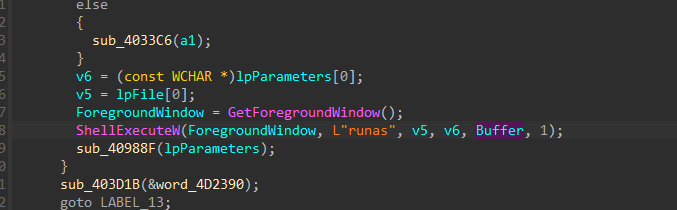

- Thus we continue our search in IDA and find that the function `ShellExecuteW` is trying to run an executable with the process name disguised as the foreground window process that the user is working on currently. This does'nt alarm the user that there is any malicious process in the background.


#### Dynamic Analysis

- For the dynamic analysis of our malware we will fire it up inside a VM . I have Windows 10 setup VM so the malware may not have any diffculty running in it.

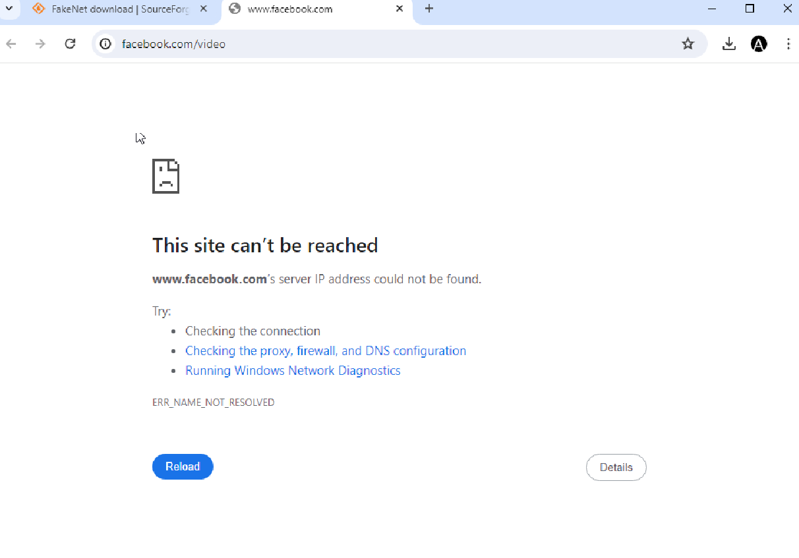

- So we can see as soon as we fire up the malware , it executes the autoit script and opens up the urls.

- Now we have seen the malware actions executed on the system let's debug it using ida inside the VM.

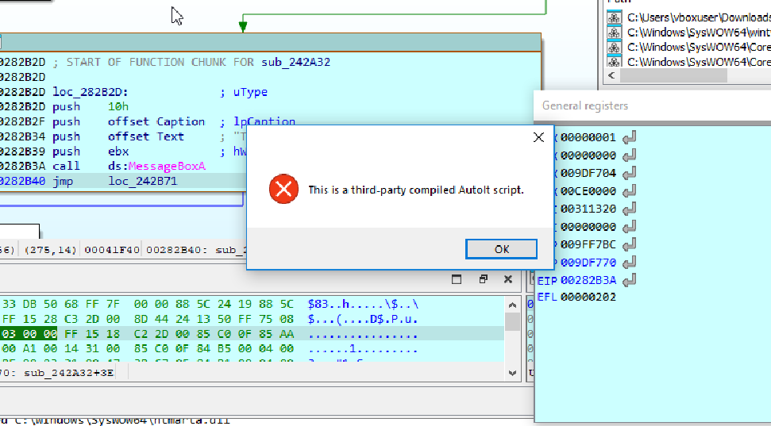

- The malware shows this when it is able to detect the debugger.

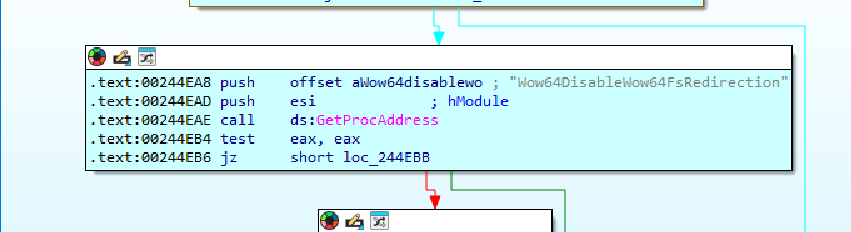

- The malware is also using `Wow64DisableWow64Redirection` function that can be used to load malicious DLLs inside the process as it disables the ability of the system to load the DLL directly from `SysWow64` or `System32` directory and load the native DLLs from the same directory where the malware is running and executing its payloads.

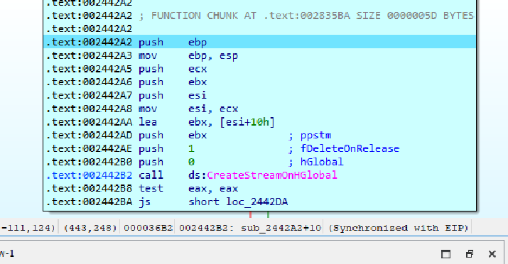

- The malware uses `CreateStreamOnHGlobal` Windows API function and tries to open the data stream of the objects inside the system.

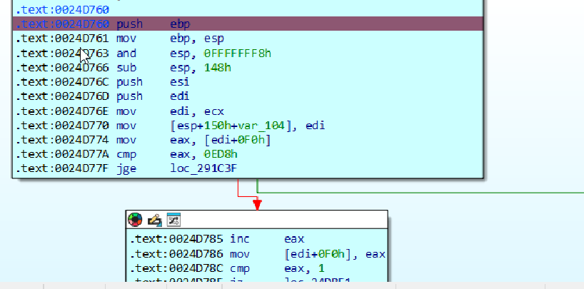

- The function at the offset `oxD670` is the function responsible for executing this script without demanding any special privileges.

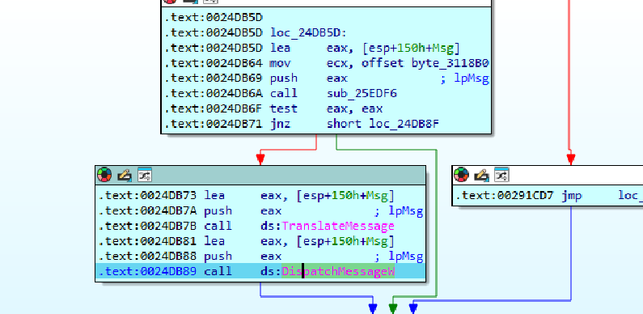

- The malware dynamically executes the functions `TranslateMessageW` and `DispathMessageW` to build up the required strings that is used inside the autoit scripts that's why they were not available inside the static strings or hardcoded strings we saw in the static analysis. Or it may be possible that they are being decrypted right now.


- Some blocks of functions trying to get the payloads to execute inside the system from the sutoit script.


#### Conclusion

```
This malware does not affect our system in any ill manner but it does execute some malicious payloads without the admin privileges and adopt some methods to hide its activity from the user in a malicious way. However what this malware does is also not allowed to be done on any system without the permission of the user. 
```
