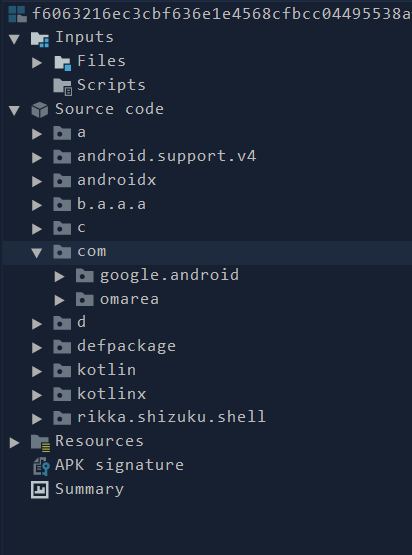

# Scene

Android security is a vast industy with a lot of oppurtunities. During my learning and studying period of Android Security I have realised that the best way to learn about the android internals is to study about the softwares that actually exploit them, the malwares. We can learn so much more from a single malware than we can ever learn from reading a book.

Today I am going to analyze a similar kind of application that is malcious for Android applications and analyze what,how and why of the apk file.


## Basic Static Analysis

```
SHA256          F6063216EC3CBF636E1E4568CFBCC04495538AFF1B0E20274BF2843E95A52CD5
SHA1            A54288A26DDBD411E19D8B37C1BE0C4AD3A280A0
MD5             C3EF564AAB7B01E698807A28F024F687
```
Let's see what VirusTotal tells us about the application


- The application is flagged malicious but not by many AV engines. Let's see what are the static strings inside the apk.

### GDA Analysis

For basic string analysis, we will use GDA tool that will analyze the malicious and other important strings inside the apk.

- Permissions


The apk requires these permissions where the marked ones are the privileged permissions that are often used by the malicious applications to exploit Android devices.

- Files Access 


From the strings of the apk, we can defer that the apk is also trying to access the power settings of the device


The marked urls prove that the apk is trying to:
- Download Magisk scripts to obtain root on the device.
- Downloading other malicious scripts from the urls like `https://vtools.omarea.com/` and `https://github.com/helloklf/vtools/blob/scene3/docs/MIUI%E6%B8%A9%E6%8E%A7%E8%AF%B4%E6%98%8E.md`. It already appears that the apk is trying to send something to this endpoint of url.


- These 3 permissions here in the `AndroidManifest.xml` tells us that the apk is able to send data and receive data from other applications while keeping the data private to itself what it wants to be private only.

## Advanced Static Analysis

Now let's decompile the apk inside Jadx and see what the apk will actually try to do to our device.



- While using Jadx, always remember that most of the apks have its main user defined code inside the `com` library. Here the main decompiled code of the apk is found in `com.omarea`.


- Here the apk is trying to use `https://github.com/RikkaApps/Shizuku` scripts to gain root.


- Apk trying to use `Signtool` to obtain signature for the external applications installed from external storage or third party apps.


- The apk tries rooting the device kernel using the `Magisk` application scripts if we choose to root the application with the option `KernelSu`.


- Here the application is also trying to modify the battery settings of the device and retrieve the details of the battery in required format. 


- The apk uses `krscripts` and commands and tools in order to start malicious rooting scripts like `executor.sh`.


- It has access to the system time modification system as well as the activities on the system like `onExit` and `onDismiss`.


## Dynamic Analysis

Now Let's fire up the malicious apk inside our Android Emulator, I am using Pixel 5 Android 13 Tiramisu emulator fromm Android studio coz well the apk had some issues installing on the Android 6 and higher versions. 


- Well it has a catchy and normal looking icon making it appear like a system application.


- This label comes as soon as we execute the app and the app does not run further until and unless we agree to the terms without showing what the prompt may do to our system permissions.


- As soon as I pressed `Agree`. The serial console enabled on my device which can be used for arbitrary command execution by any application. It may be because of all those commands of `adb` and the scripts that the apk wants to execute on the device.


- The adb mode is enabled through executing a script let's extract the script :

```
scene="com.omarea.vtools"

SOURCE_DAMON="/storage/emulated/0/Android/data/$scene/daemon"
SOURCE_TOYBOX="/storage/emulated/0/Android/data/$scene/toolkit/toybox-outside64"
SOURCE_BUSYBOX="/storage/emulated/0/Android/data/$scene/toolkit/busybox"

STARTER_PATH="/data/local/tmp/scene-daemon"
TARGET_TOYBOX="/data/local/tmp/toolkit/toybox-outside"
TARGET_BUSYBOX="/data/local/tmp/toolkit/busybox"
toolkit="/data/local/tmp/toolkit"

mkdir $toolkit
# Env PATH add /data/local/tmp
export PATH=$PATH:$toolkit

cp $SOURCE_DAMON $STARTER_PATH
chmod 777 $STARTER_PATH
echo 'Success: Copy [scene-daemon] to complete'

cp $SOURCE_TOYBOX $TARGET_TOYBOX
chmod 777 $TARGET_TOYBOX
echo 'Success: Copy [toybox-outside] to complete'

cp $SOURCE_BUSYBOX $TARGET_BUSYBOX
chmod 777 $TARGET_BUSYBOX
echo 'Success: Copy [busybox] to complete'

echo 'Install BusyBox……'
cd $toolkit
for applet in `./busybox --list`; do
  case "$applet" in
  "sh"|"busybox"|"shell"|"swapon"|"swapoff"|"mkswap")
    echo '  Skip' > /dev/null
  ;;
  *)
    ./busybox ln -sf busybox "$applet";
  ;;
  esac
done
./busybox ln -sf busybox busybox_1_30_1

echo ''
nohup $STARTER_PATH >/dev/null 2>&1 &
if [[ $(pgrep scene-daemon) != "" ]]; then
  echo 'Scene-Daemon OK! ^_^'
else
  echo 'Scene-Daemon Fail! @_@'
fi

cmd package compile -m speed $scene >/dev/null 2>&1 &

dumpsys deviceidle whitelist +$scene >/dev/null 2>&1
cmd appops set $scene RUN_IN_BACKGROUND allow >/dev/null 2>&1
echo ''
```
- The apk here enables `Doze` mode that makes sure that the apk is not affected by any bettery optimization and can control the battery drain anyhow it likes.


- This gives us options to choose how we would like to root our device.


- Here the apk is trying to get an arbitrary read permission ion the external storage and able to access it, alongwith acces to write to the storage of the device.

```
09-17 19:54:30.223  4747  4751 I artd    : Running dex2oat: /apex/com.android.art/bin/art_exec --drop-capabilities --set-task-profile=Dex2OatBootComplete --set-priority=background --keep-fds=7:8:9:10 -- /apex/com.android.art/bin/dex2oat64 --zip-fd=7 --zip-location=/data/app/~~8GMv1SVym_pHZPYctdz2SQ==/com.omarea.vtools-JCdREGyPLNy_ldw2rar_WA==/base.apk --oat-fd=8 --oat-location=/data/app/~~8GMv1SVym_pHZPYctdz2SQ==/com.omarea.vtools-JCdREGyPLNy_ldw2rar_WA==/oat/x86_64/base.odex --output-vdex-fd=9 --swap-fd=10 --class-loader-context=PCL[] --classpath-dir=/data/app/~~8GMv1SVym_pHZPYctdz2SQ==/com.omarea.vtools-JCdREGyPLNy_ldw2rar_WA== --instruction-set=x86_64 --instruction-set-features=default --instruction-set-variant=x86_64 --compiler-filter=verify --compilation-reason=install --compact-dex-level=none --max-../images_scene/image-block-size=524288 --resolve-startup-const-strings=true --generate-mini-debug-info --runtime-arg -Xtarget-sdk-version:30 --runtime-arg -Xhidden-api-policy:enabled --runtime-arg -Xms64m --runtime-arg -Xmx512m --comments=app-version-name:7.3.0 Alpha9,app-version-code:720240609,art-version:340818022
09-17 19:54:30.223  4747  4751 I artd    : Opened FDs: 7:/data/app/~~8GMv1SVym_pHZPYctdz2SQ==/com.omarea.vtools-JCdREGyPLNy_ldw2rar_WA==/base.apk 8:/data/app/~~8GMv1SVym_pHZPYctdz2SQ==/com.omarea.vtools-JCdREGyPLNy_ldw2rar_WA==/oat/x86_64/base.odex.CVZ9YR.tmp 9:/data/app/~~8GMv1SVym_pHZPYctdz2SQ==/com.omarea.vtools-JCdREGyPLNy_ldw2rar_WA==/oat/x86_64/base.vdex.MSNITe.tmp 10:/data/app/~~8GMv1SVym_pHZPYctdz2SQ==/com.omarea.vtools-JCdREGyPLNy_ldw2rar_WA==/oat/x86_64/base.odex.swap.AyU7ey.tmp 
```

- These above logs describe the measures taken by the apk to optimize its performance. It actually uses `dex2oat` to convert its dex code directly into `oat` code so that the efficiency of the application increases.
- To execute the `dex2oat` tool it uses `art daemon` to be able to execute the tool in the background.

```
D nativeloader: Configuring clns-6 for other apk /data/app/~~8GMv1SVym_pHZPYctdz2SQ==/com.omarea.vtools-JCdREGyPLNy_ldw2rar_WA==/base.apk. target_sdk_version=30, uses_libraries=, library_path=/data/app/~~8GMv1SVym_pHZPYctdz2SQ==/com.omarea.vtools-JCdREGyPLNy_ldw2rar_WA==/lib/arm64:/data/app/~~8GMv1SVym_pHZPYctdz2SQ==/com.omarea.vtools-JCdREGyPLNy_ldw2rar_WA==/base.apk!/lib/arm64-v8a, permitted_path=/data:/mnt/expand:/data/user/0/com.omarea.vtools
```

- These logs reveal the actual `.so` libraries location inside the device.


- The `Scene` apk also obfuscates the log messages as an evasion mechanism

```
D ConnectivityService: requestNetwork for uid/pid:10183/5219 activeRequest: null callbackRequest: 147 [NetworkRequest [ REQUEST id=148, [ Capabilities: INTERNET&NOT_RESTRICTED&TRUSTED&NOT_VCN_MANAGED Uid: 10183 RequestorUid: 10183 RequestorPkg: com.omarea.vtools UnderlyingNetworks: Null] ]] callback flags: 0 order: 2147483647
09-17 19:55:06.027   600  2434 
```
- The apk is also requesting network connectivity through the Internet Access having a low priority.

- We are getting the logs of the device giving us what are the steps done by the malicious apk to gain root of the device but here we are not getting the info about what is triggering what inside the apk. Thus we could use Frida to analyze the apk dynamically but as I had a hard time with my pc and so I am putting my frida analysis for the next application :/ .

Moreover the apk appears to be a less harmful application that can be used generally to gain root on the device required in some situations when the device is being debugged or pentested. 

However the apk is flagged malicious cause of the third party scripts and the explicit techinques it uses to gain root on the device and also control the privileged acitivities like battery draining and network on the device. 
