## Reversing LuckyPatcher(11.6.7) apk

Most of the people should already be familiar with LuckyPatcher application.

Still just to give an introduction, LuckyPatcher application is a master tool that enables us to modify and patch the applications inside your Android device to unlock premium features, disable ads, modify permissions and gain some great advantages.

In this blog, we will discuss what can this tool do and how does it do it? How is it able to remove ads inside the applications and how is it able to provide us the products inside the app without even paying any fee.

Here I am using LuckyPatcher version 11.6.7. You can download the apk from: 
[LuckyPatcher ver:11.6.7](https://www.luckypatchers.com/download/)


### Modifying apps using LuckyPatcher apk.
- First of all the installer apk needs the permission `android.permission.REQUEST_INSTALL_PACKAGES` to be able to install external packages inside our device. (This is already a very dangerous prmission to grant to an application and should not be provided to any unknown app).
- It also needs the permission to read and write the storage data on our device.

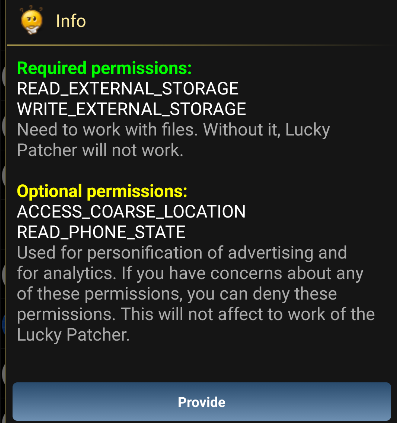

- Here we can see that LuckyPatcher shows the apps inside the device in the colours:
    - Green: Can be registered and modified.
    - Yellow: Has a custom patch available.
    - Blue: Contains Google Ads.
    - Purple: A system app.
    - Red: Cannot be modified.

```
Custom patches are some of the patches made by users all over the world and the creator of LuckyPatcher for various applications.
```

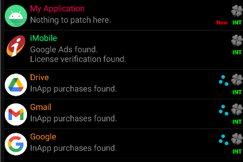

- It also shows the patches that can be made inside the apps. Like this list shows the patches that can be made inside the ICICI mobile banking app:

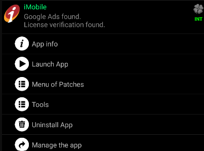


- The app is then rebuilt with the patch selected and using the tools.

### Removing Ads

- We will try to remove ads inside a little game named `fly bird`.


- Now when we patch the app to remove ads inside it. No ads appear.


```
Make sure that the patched application has the same signature as the original application and if not then just simply uninstall the original apk and install the patched one.
```

### Static analysis in JADX
- As I went through the code of LuckyPatcher, I was focused on the commands or maybe the tools used by it to modify the apps on the device. And I found many too: 

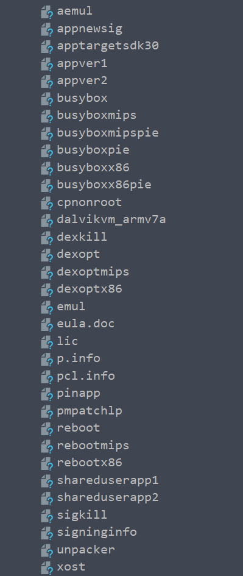

- This method is disabling the SELinux policy inside the device to have more privileges and control over the device as SELinux policies does not allow read or write permissions in sensitive directories of the device even after gaining root privileges.

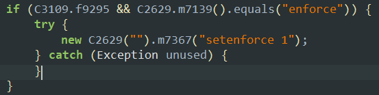

- The app also listens for various broadcasts related to the system inside the device.


```
 private static void registerReceivers(Context context) {
        if (receiversRegistered) {
            return;
        }
        Context applicationContext = context.getApplicationContext();
        C3109.m8105("LuckyPatcher: PackageChangeReceiver");
        PackageChangeReceiver packageChangeReceiver = new PackageChangeReceiver();
        IntentFilter intentFilter = new IntentFilter();
        intentFilter.addAction("android.intent.action.PACKAGE_REMOVED");
        intentFilter.addAction("android.intent.action.PACKAGE_REPLACED");
        intentFilter.addAction("android.intent.action.PACKAGE_ADDED");
        intentFilter.addAction("android.intent.action.PACKAGE_CHANGED");
        intentFilter.addAction("android.intent.action.MY_PACKAGE_REPLACED");
        intentFilter.addDataScheme("package");
        applicationContext.registerReceiver(packageChangeReceiver, intentFilter);
        C3109.m8105("LuckyPatcher: BinderLuckyPatcher");
        BinderBootReceiver binderBootReceiver = new BinderBootReceiver();
        IntentFilter intentFilter2 = new IntentFilter();
        intentFilter2.addAction("android.intent.action.BOOT_COMPLETED");
        intentFilter2.addAction("android.intent.action.MEDIA_SCANNER_FINISHED");
        intentFilter2.addAction("android.intent.action.MEDIA_SCANNER_STARTED");
        intentFilter2.addAction("android.intent.action.MEDIA_MOUNTED");
        intentFilter2.addAction("android.intent.action.MEDIA_EJECT");
        intentFilter2.addAction("android.intent.action.MEDIA_UNMOUNTED");
        intentFilter2.addAction("android.intent.action.MEDIA_REMOVED");
        intentFilter2.addDataScheme("file");
        applicationContext.registerReceiver(binderBootReceiver, intentFilter2);
        C3109.m8105("LuckyPatcher: OnBootLuckyPatcher");
        OnBootReceiver onBootReceiver = new OnBootReceiver();
        IntentFilter intentFilter3 = new IntentFilter();
        intentFilter3.addAction("android.intent.action.BOOT_COMPLETED");
        intentFilter3.addAction("android.intent.action.EXTERNAL_APPLICATIONS_AVAILABLE");
        intentFilter3.addAction("android.intent.action.EXTERNAL_APPLICATIONS_UNAVAILABLE");
        intentFilter3.addAction("android.intent.action.UMS_DISCONNECTED");
        intentFilter3.addAction("android.intent.action.POWER_DISCONNECTED");
        intentFilter3.addAction("android.intent.action.MY_PACKAGE_REPLACED");
        applicationContext.registerReceiver(onBootReceiver, intentFilter3);
        C3109.m8105("LuckyPatcher: OnAlarmReceiver");
        OnAlarmReceiver onAlarmReceiver = new OnAlarmReceiver();
        IntentFilter intentFilter4 = new IntentFilter();
        intentFilter4.addAction("com.ui.OnAlarmReceiver.ACTION_WIDGET_RECEIVER");
        applicationContext.registerReceiver(onAlarmReceiver, intentFilter4);
        C3109.m8105("LuckyPatcher: RootlessInstallerReceiver");
        applicationContext.registerReceiver(new C2595(), new IntentFilter("com.ui.action.INSTALLATION_STATUS_NOTIFICATION"));
        C3109.m8105("LuckyPatcher:Registered receivers from " + context.getClass().getName());
        receiversRegistered = true;
    }
```


### Patching an App
- The patcher uses this method to handle dalvik code:

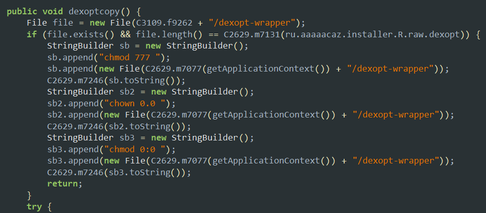

- The patcher makes the `.dex` files inside the apk executable using the command `chmod 777`, `chown 0.0` and `chmod 0.0`, then uses `dexopt-wrapper` command line tool to optimize these dex files into `.odex` files.

- These binaries like `dexopt-wrapper` are embedded into the patcher like this.

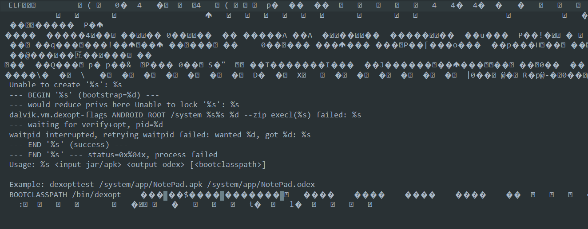

- Here the LuckyPatcher shows its feature to be able to patch a list of apps everytime the device is booted/rebooted. The apps are stored inside the list called `bootlist` and then they are patched everytime in the same manner.


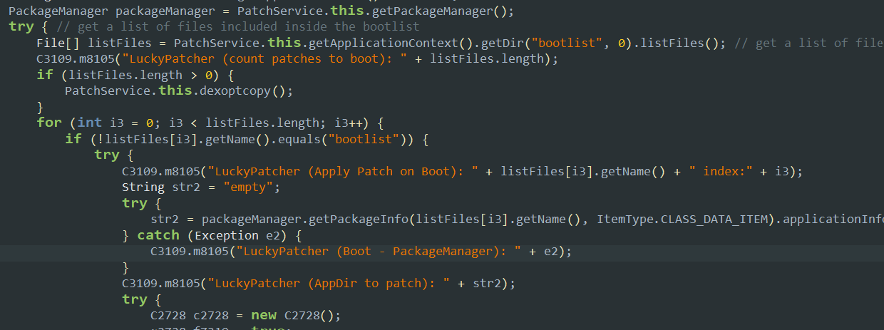

- Luckypatcher also uses a binder to communicate between the target app and itself. This binder is managed by a text file whose path is described here.

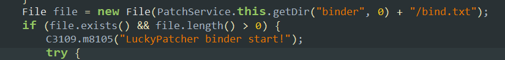


- The patcher apk is also using the famous `busybox` binary that is called the swiss army knife of Unix utilities. 


- Here it is using this tool to just `mount` (mounting) the app directory on another directory.

```
Busybox binary is a Unix utility that provides faster and advanced features  on all the basic Unix utulities like ls,cd,mkdir,etc.

It is generally used inside a rooted device environment to execute privileged commands.
```

- Now lets try to patch the game `Hunter Assassin` to be able to elevate the inApp purchases so that we can access restricted content using the LuckyPatcher application.


### Receiving the boot broadcast
- We come to know that the app is trying to start itself just after it received the broadcast of `Device Booted`.

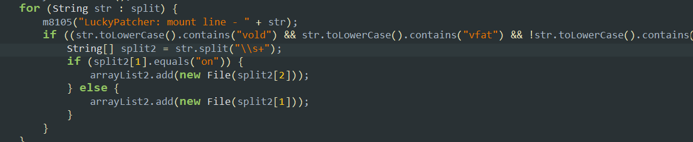

- This fn here excutes the command `mount` to get all the mounted filesystems' paths inside the device. Then it tries to find the paths of known binaries like `vold`, `vfat`, etc and stores them if they contain `on` meaning only the active mounted filesytems.
- Also here the app uses `mount -o bind` command so it is not creating any new filesystem but rather just making a new path reference an old path inside the filesystem.
- This is important for the patcher as it has to extract the real filepaths for the binaries and the processes inside the device.


### Hiding from Google play protection
- The patcher app hides its name to appear in the packages list by changing its application ID:


### Storage data
- The patcher apk has the stored data inside the filepath: `/data/data/ru.tyozedjz.fiaqovwzr/files` in the json format.
- The other configuration data of the patcher app is also stored inside the sd card storage in the path: `/storage/emulated/0/Android/data/ru.tyozedjz.fiaqovwzr/files/LuckyPatcher/`.

## How does LuckyPatcher remove Ads?
- This is a important feature of LuckyPatcher through which it is able to ensure that no ads are shown by the application ever after.
- This is done using a AdsBlockList embedded inside the app. This list is stored at: `/storage/emulated/0/Android/data/ru.tyozedjz.fiaqovwzr/files/LuckyPatcher/AdsBlockList.txt`. It potentially contains a number of website urls that will be blocked by the patcher by simply erasing them inside the target application.

```

[HTTP]
/ads
.ads. 
-ads.
.ad.
/ad.
advert
.gstatic.com
.admob.com
.analytics.localytics.com
.greystripe.com
inmobi.com
admax.nexage.com
my.mobfox.com
.plus1.wapstart.ru
.madnet.ru
.inmobi.com
.mp.mydas.mobi
millennialmedia.com
.g.doubleclick.net
.appsdt.com
run.admost.com
mobile.admost.com
amazon-adsystem.com
.appnext.com
.flurry.com
googlesyndication.com
google.com/dfp
inmobicdn.net
moatads
.mopub.com
unityads.unity3d.com
adc3-launch
adcolony.com
mobile-static.adsafeprotected
applovin.com
applvn.com
appnext.hs
live.chartboost.com
www.dummy.com
.api.vungle.com
pubnative.net
supersonicads.com
info.static.startappservice.com
init.startappservice.com
req.startappservice.com
imp.startappservice.com
sb.scorecardresearch.com
crashlytics.com
udm.scorecardresearch.com
adz.wattpad.com
ad.api.kaffnet.com
dsp.batmobil.net
61.145.124.238
alta.eqmob.com
graph.facebook.
t.appsflyer.com
net.rayjump.com
.yandex.net
appodeal.com
amazonaws.com
.baidu.com
.tapas.net
.duapps.com
smaato.
ad-mail.ru
yandexadexchange.
yandex.com
tapjoyads.com
tapjoy.com

[ALL_STRINGS]
com.google.android.gms.ads.identifier.service.START
ads.mopub.com
doubleclick.net
googleadservices.com

```  
- The app will simply erase these urls so that the target app cannot communicate with the url where it is able to fetch the ads. It has some http specific urls and some strings that might appear inside the methods trying to fectch google ads.
- There is also a list named `AdsBlockList_user_edit.txt` that stores the urls that the user custom edits if he wants to block more ads or either allow ads from some urls.
- After patching the apk the patcher also has to ensure that the app is accepted by the device. To do this it signs the application with another signature and simply put the apk into the path of thr original apk.

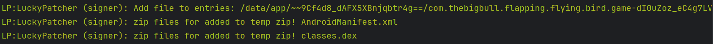


## How does LuckyPatcher tries to elevate and modify the inApp purchases?
- LuckyPatcher uses a helper application `pinapp.apk` to hide and bypass itself through the google play protection inside the device.
- It can be found at the path: `/storage/emulated/0/Android/data/ru.tyozedjz.fiaqovwzr/files/LuckyPatcher/tmp/pinapp.apk`.
- This pinapp.apk is reponsible for patching and emulating the inApp purchases inside the application. I observed that when I am trying to patch and elevate the inApp purchases then LuckyPatcjher is trying to access and execute the apk `pinapp.apk`. 

Now lets try to understand what does this apk does exactly to bypass these purchases

- The pinapp application simply works as a proxy between the application and the google play API that supports inApp billing (using com.android.vending).
- It just fools the application that it is communicating to the actual google play API while it sends the responses to the requests made by the target app so that the target app will allow restricted content.
- This is an important feature of LuckyPatcher and so I reversed and noted down every observation I could make out of this ap methods:
    - Firstly, the application runs it process as a service in the background to avoid interception and hide from the google play protection.
    - This method is checking if the target app supports inAppBilling or not. This is done by just calling the API method: `mService.isBillingSupported()` and try to connect to the billing service using `connectToBilling()` method.
    
    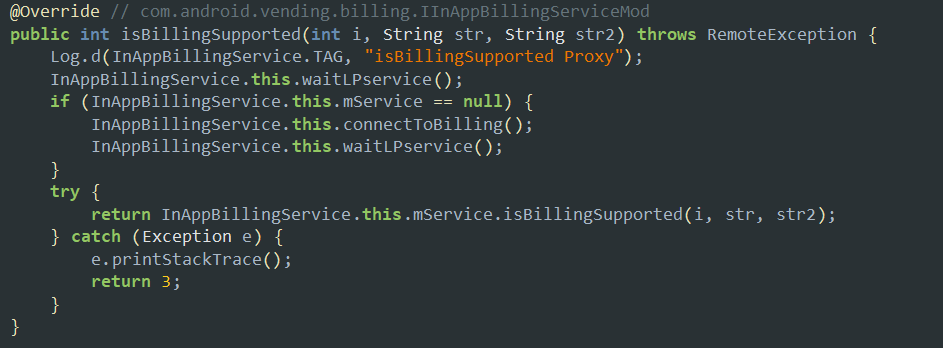

    - This method retrieves the details of the one-time inApp purchases inside the target application, may refer to a one-time buy product too.

    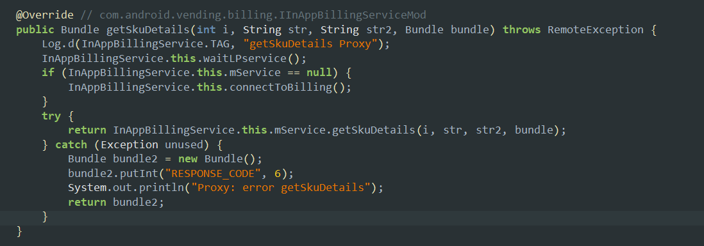

    - This method here is used to start the purchase flow inside the target application by sending an intent to the app.

    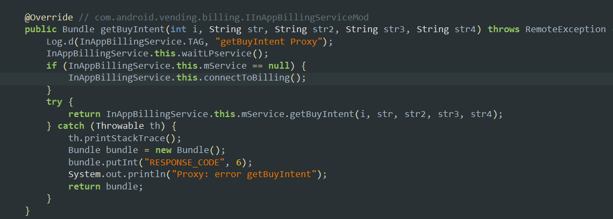

    - This method is used to retrieve the details about the purchase history of the user so that the user donot have to buy the same thing again and again once it is purchased inside the target application.

    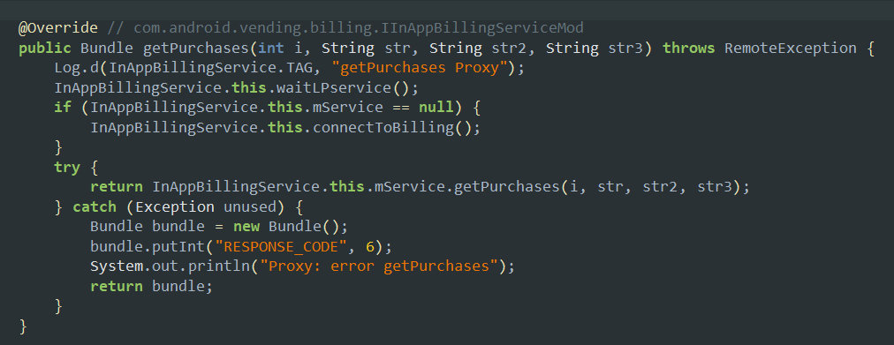


    - The method `consumePurchase` is used to consume an inApp product so that the user can buy it again after consuming:

    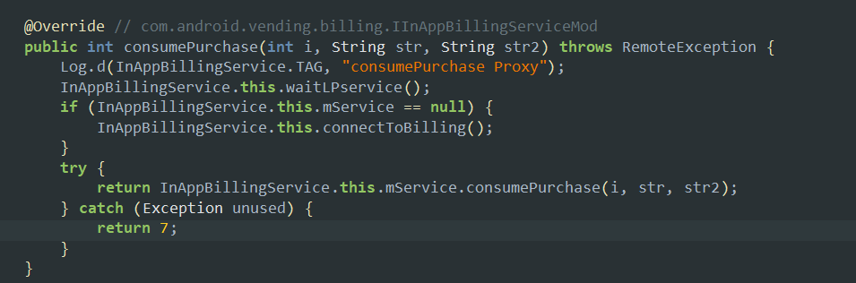

    - The below method is used to retrieve the intent that is meant to show the user, screen with the subscription management of the application inApp products.

    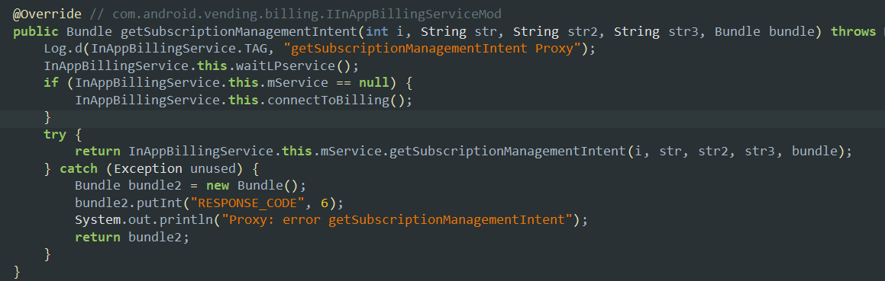

    - This method is the main method that acknowledges the payment done to the Google play billing system. It is basically the confirmation an app needs to be able to finalize the purchase but it needs to return a bundle with some particular data that will be checked.

    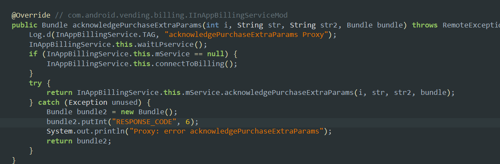

    - Here the application is trying to execute a component hijacking attack by binding to the service `com.android.vending` to be able to proxy what the app actually does when an inAppPurchase is made using it.

    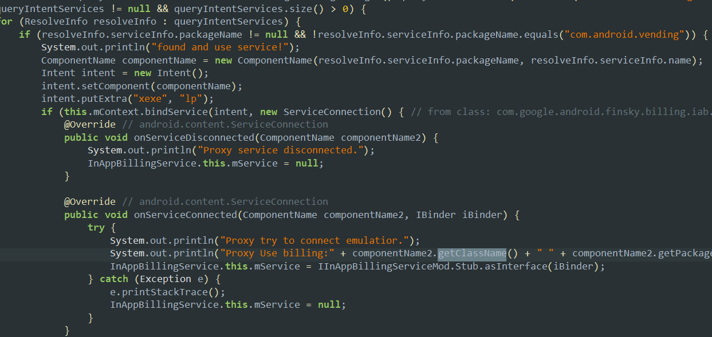

    - It also checks if the service bound is right or not by checking the action of the intent.

    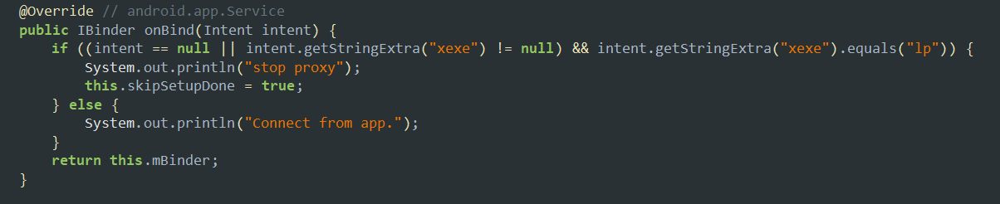

- It is important to know that the apps that donot use much secure validation system on the backend server are the one that can be patched using LcukyPatcher application tool.

### Patching inAppPurchases inside the app Hunter Assassin

- This is the example of one of the inApp product inside the application that can be purchased by the user.


- Then if we try to purchase anything inside the app, we get option to have it for free everytime we open the application:

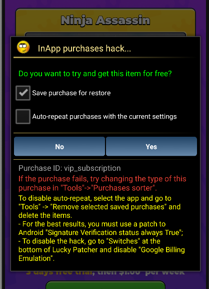

## Dynamic analysis
- Lets use frida to intercept what happens inside the patcher exactly when we try to remove ads from an apk.

- Whenever we remove any package from the device then the patcher applicatuion comes to knwo about that using the method with privileged intent as an argument:

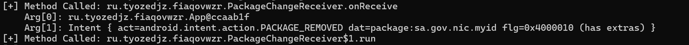

- These logs tell us that LuckyPatcher is actually started at the time our device is booted or rebooted and is not in our control to start its execution.

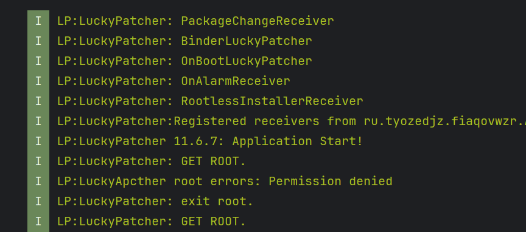

- It then sends and receives various intents regarding the data that resembles the mounted paths or the references of the filepaths inside the device.
- All those services like binders and tools that I have described previously are started and executed at the boot time of the device by the application.
- Using the logcat logs, we can see that when we try to remove ads from the target app, then we are not using the signer extensively while when we try to alter the inAppPurchases then we are using the signer to modify and sign the zip archive extensively.

For removing Ads:

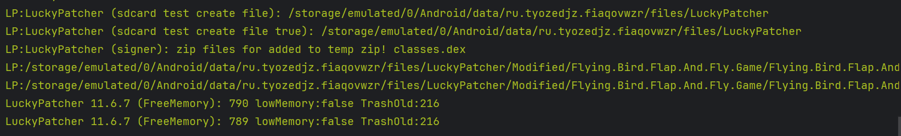

For altering inAppPurchases:

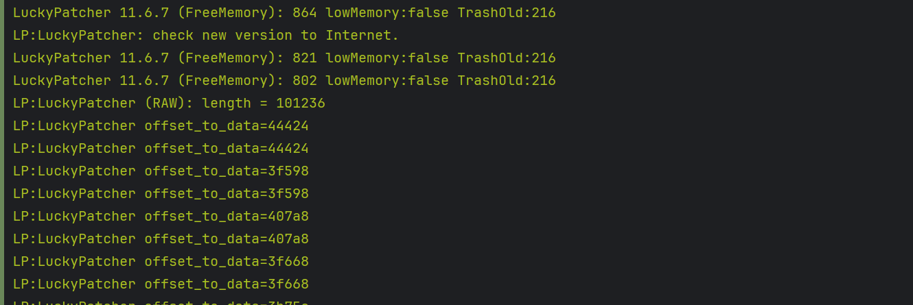

- The patcher application calculates the offset of the data it wants to modify inside the target application using the xml files and then patch them.

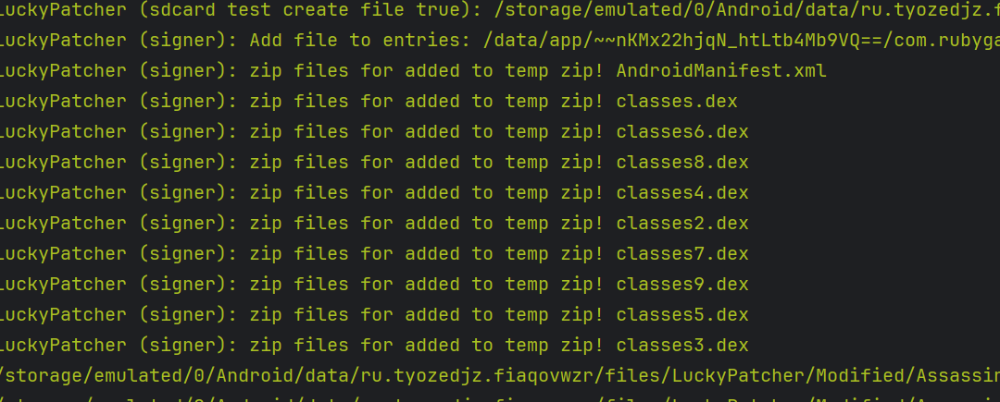

- All dex files are then added to the same zip archive after patching and then coverted to an apk file.

- During the InAppPurchase hack, the signer modifies each and every file of the apk and also tries to bypass the signature verification flow of the target app that makes the signer do more extensive work and sign the zip archive where the modified app is stored.

- When we reopen the application then the app checks for the Play API that the target app is using to perform billing flow.

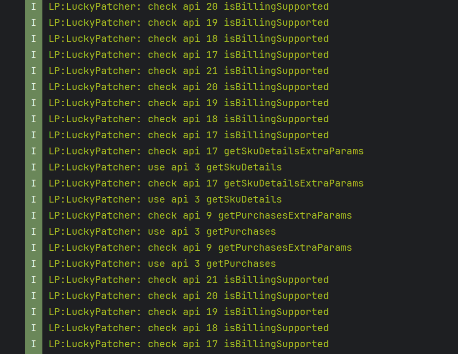

- Then it simply tries to emulate the same flow as a proxy.


## Conclusion

Overall we can see that the LuckyPatcher uses a combination of simple tricks to be able to achieve something inside any application.

However, it is true that many applications have updated their backend servers and their signature verification systems to be able to ensure that they can compete with these type of hacks.

Through this blog I tried to explain the working of LuckyPatcher version: 11.6.7 which might be very different from the version that we have for now of LuckyPatcher.

`It would be great if any reader too will try to know what are the updates made by chelpus (creator of LuckyPatcher) inside his application to counter these prevention mechanisms.`

