--- 
title: "Debugging Java Dynamically - The Power of JDB"
date: 2025-04-14 00:00:00  +0800
categories: Reverse_Engineering
tags: [Reverse_Engineering,Java]
---

So I was reversing a Java binary on weekend and suddenly a thought crossed my mind:

`Is there a way to do dynamic analysis on Java binaries ?` 

Reversing Java binaries is not very difficult nowadays, especially with tools like JADX, which give us a clear idea of the entire structure and flow of a Java program. However, most tools available for Java reversing rely heavily on static analysis and decompilation to retrieve the source code.

But sometimes, developers employ heavy obfuscation and reflection techniques that cause the program to load most of its critical logic at runtime, rather than showing it in the decompiled source code. This makes it much harder for reverse engineers to analyze the program statically.

This is where JDB comes in. It's similar to the GDB debugger, but specifically made for Java bytecode. With JDB, we can do the same kinds of things we’d do with GDB: set breakpoints, inspect variables, and hook into functions — all at runtime.

So in this blog, we’ll explore How to use JDB, understand how it works behind the scenes, and walk through a simple CTF challenge from Flare-On 5 to demonstrate its power in real-world Java binary reversing.

### JDB Usage

To install JDB inside your system check its version using 

```
jdb -version
```

If it is not installed, then just install OpenJDK 

```
sudo apt update
sudo apt install openjdk-17-jdk
```

For windows users, OpenJDK can be installed from 
[[https://openjdk.org/install/]]

Now we have to run the java binary in a suspended debug mode and then attach JDK to that debug session.

If the file is a `.jar`binary file run:
```
java -agentlib:jdwp=transport=dt_socket,server=y,suspend=y,address=5005 -jar FileName.jar
```
This command will run the file in suspended debug mode at the addresses with port `5005`. 

Then we have to open another terminal and attach JDB to the debug session using the same port:

```
jdb -attach 5005
```

After this we can debug the instructions inside the binary one by one using JDB commands. Here are some of them that are commonly used:

#### Breakpoints
- `stop at {Class_Name}:{Line}` :  JDB works line by line as a interpreter usually works and so  instead of any addresses or instructions, we give line number and method or class names to JDB to set breakpoints.
- `stop in {Class_Name}.{Method}` : this puts breakpoint on the first instruction of the given method.
- `clear` : clears all breakpoints
#### Variables inspection
- `print {expression}` : JDB can print the value of the expression loaded inside the program code if it is valid inside the code.
- `locals` : This shows all the local variables of the current frame. (similar to stack frames generally facilitates a single method call in Java).
- `frame` : Shows all the current running frames inside the code.
- `set {var} = {value}` : This changes the value of the variable inside the code.

#### Navigation through the code
- `run`: Starts the program execution again.
- `cont`: Continues the execution of the program.
- `next`: Steps over to next line.
- `step up` : Steps out of the current method.
- `list`: This is used to find lines around the current execution program line `But only works if we have attached the Java source code with it`.
- `where`: It returns `Class_Name:Line` where our debugger is at currently.

There are many more JDB commands that can help us to debug Java programs. However the above given commands are the most commonly used and are more than enough for one to analyze a Java binary at runtime.
### Working of JDB explained

Most of us are familiar with how traditional debuggers operate — they halt a program's execution at a specific instruction by injecting trap signals like `INT3`. When a breakpoint is hit, this trap redirects control back to the debugger, allowing inspection of the program's state.

However, debuggers for interpreted languages such as Java work quite differently. They don't modify native code or inject trap instructions to handle breakpoints. So, how do they manage to pause execution at runtime, and do what normal debuggers do in C/C++ binaries ? 


JDB uses JPDA (Java Platform Debugger Architecture) to control the execution of the binary. 
It attaches to the JVM running the binary using JDWP and tells it to do what the user wants to do through the debugger.
- Inserting breakpoints
	To insert breakpoints are inserted inside the bytecode of the binary instead of any native code or instructions.
	- When I tell the debugger to `stop at {TargetClass}:{TargetLineNumber}`, it inserts a breakpoint at that line inside that class.
	- This request for setting the breakpoint goes to JDWP to set a breakpoint at the line that further forwards it to JVMTI (JVM Tool Interface)
	- The JVMTI sets an internal event at the line where the breakpoint is requested.
	- Now after the program is run, at every line the JVM checks if there is a breakpoint event at the current line or not. If it finds the event, then it stops the execution of the program then and there only and gives execution back to JDB and the user.
- Stepping over/into the line
	- `step` command steps into the method. It basically tells the JVM to stop as soon as a new line is encountered.
	- The `next` command steps over the next line in the bytecode and tells the JVM to skip any change of frame and thus skip stepping into any method call if encountered on the next line.
- Examining variables and local stack values
	To achieve this the JVMTI parses the whole stack and get the local variables from the current frame of the interpreter. This may also include object references inside the method.

The basic execution flow of the debug session is :
```
JDB -> JDI(Java Debug API) -> JDWP -> JVMTI
```
  
### Demonstration (Flare-on 5 Challenge 1)

I have the first challenge of Flare-On 5 here as an example. 
In this challenge, we are given a jar file that when executed demands a password from us and then prints if the password is wrong or right.

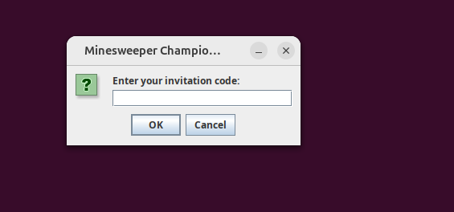
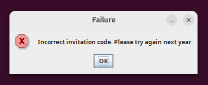

However it is very easy challenge that can be easily done using a Java decompiler like JADX. 

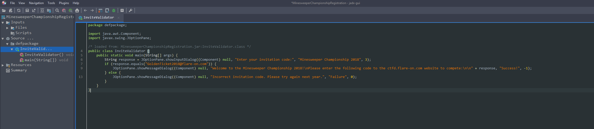

But just to get an idea of JDB, we will try to get the correct password using JDB instead of static analysis using JADX decompilation.

#### Debugging

- First we will need the class name to set a breakpoint at the main method of the binary. We will do this using the command `jar tf <FileName.jar>`.


- We know now that we have the main class of the name `InviteValidator` and the methods inside that class can be obtained using the command `javap -c MainClassName`.


- Now let's start debugging the jar file: We will open two terminals with commands:
	- `java -agentlib:jdwp=transport=dt_socket,server=y,suspend=y,address=5005 -jar MinesWeeper.jar`.

	- And another terminal with command: `jdb -attach 5005`.
	
This will connect the debugger to the challenge file.

- So we have a method with signature `InviteValidator.main()`. Now we can easily set a breakpoint on start of this method.

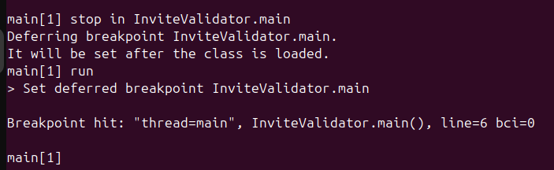

- Right now I give a random input of `hello_world`.

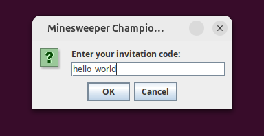

- We have to find where our input is stored inside the program. Thus we can just use `locals` or `print <VariableName>` commands to print the values of variables in the current frame or for a specific variable.

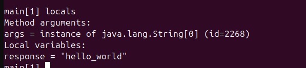

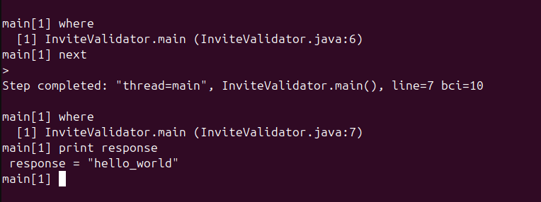

- Now we know where our input is going to, we can just refer the `javap` disassembly information again and see that we have the method `.equals()` doing the trick. So if we are able to get the arguments of `java.lang.String.equals()` method then we can easily get the correct password. To do this we will hook the `.equals()` method:
- It is important to note that `java.lang.String.equals()` method is a standard JVM function and thus we cannot enter inside the method using `step` command. Thus we will have to use breakpoint for the method.

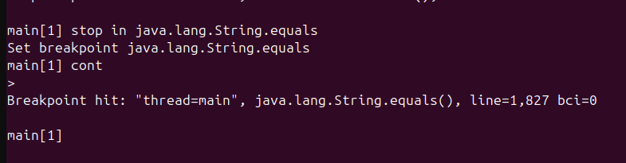

- Now analyzing the local variables gives us the arguments for the function:

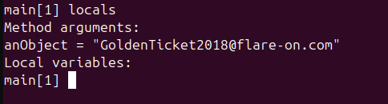

This gives us our flag : `GoldenTicket2018@flare-on.com` which is also the argument for the `equals()` method here.

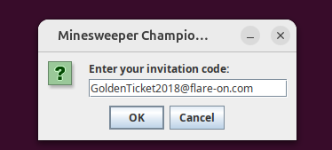

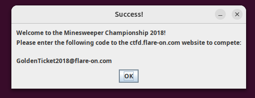


