# No Clicks Required: The Nightmare Scenario

Imagine sitting in a crowded coffee shop, your phone resting peacefully in your pocket. You haven’t clicked on any suspicious links, you haven’t downloaded any sketchy apps, and you haven’t handed your device to anyone. Yet, a stranger sitting a few tables away has just taken complete control of your phone.


This is what the BlueFrag (CVE-2020-0022) vulnerability was all about. This vulnerability was found in Android 8 and Android 9.

When cybersecurity experts rate a vulnerability as `Critical` they aren't exaggerating, and BlueFrag earned that title for a few reasons - 

1. **A zero click exploit**: Most attacks require you to make a mistake - like opening a bad email attachment, downloading a malicious app or falling for a phishing scam but attacks like BlueFrag requires **zero interaction** from the victim. An attacker just needs to be in the bluetooth range of the victim's device and he can have complete control of the device.

2. **Invisible to the user**: The attack happens totally in the background without any notifications or malicious signs. You would never know you were hacked until it was too late.

3. **Full access** : Using this vulnerability, the attacker cannot just read but also write into your device. Leaking all your personal photos, messages, banking details or even turn your phone into a weapon to hack into others' devices.

# The BlueDroid Stack

Before understanding why does the vulnerability occur inside the device. We have to understand the basic architecture of the bluetooth stack and the packets format in a bluetooth connection.

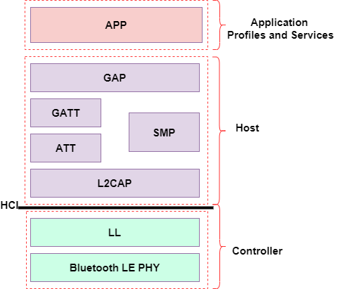

The bluetooth connection works on HCI and L2CAP protocols. The L2CAP protocol is the high level protocol while the HCI protocol is the hardware layer of the bluetooth network. Both of these protocols make the Bluetooth stack of the device that resides inside the `bluetooth.default.so` binary working as `com.android.bluetooth` service.

## HCI (Host Controller Interface): The Hardware Bridge

The HCI protocol is the standardized communication layer between the OS software (Host) and the Bluetooth chip (Controller). It defines how commands, events, and data are passed back and forth.

When devices are connected and exchanging standard data, they use **HCI ACL (Asynchronous Connection-Less)** data packets.

Because the physical Bluetooth controller has strict limits on how much data it can send at once over the air, the HCI layer has a maximum packet size. If a higher-level protocol wants to send a large chunk of data, it cannot be sent in a single HCI packet. It must be fragmented. To handle this, the HCI ACL packet header includes **Boundary Flags**. These flags tell the receiving device:

An HCI packet looks like this:
```
0                   1                   2                   3
 0 1 2 3 4 5 6 7 8 9 0 1 2 3 4 5 6 7 8 9 0 1 2 3 4 5 6 7 8 9 0 1
+-+-+-+-+-+-+-+-+-+-+-+-+-+-+-+-+-+-+-+-+-+-+-+-+-+-+-+-+-+-+-+-+
|             Handle            | PB  | BC  |    Data Length    |
|           (12 bits)           |(2b) |(2b) |     (16 bits)     |
+-+-+-+-+-+-+-+-+-+-+-+-+-+-+-+-+-+-+-+-+-+-+-+-+-+-+-+-+-+-+-+-+
|                                                               |
|                                                               |
~              HCI Payload (Variable Length)                    ~
|                                                               |
|                                                               |
+-+-+-+-+-+-+-+-+-+-+-+-+-+-+-+-+-+-+-+-+-+-+-+-+-+-+-+-+-+-+-+-+
```

`PB (Packet Boundary Flag): It tells the device if it is the continued fragment (0x1) of a previous packet or start of a new packet (0x2)`

## L2CAP: The Traffic Cop and the Fragmenter

Sitting directly above the HCI layer inside the Host stack is the **L2CAP (Logical Link Control and Adaptation Protocol)**. L2CAP is the higher layer of the Bluetooth stack. It has two main jobs:

1. **Multiplexing:** It allows multiple different higher-level protocols to share the same physical Bluetooth link. It uses Channel Identifiers (CIDs) to route traffic to the right place.

2. **Segmentation and Reassembly (SAR):** This is the critical mechanism for BlueFrag. Because L2CAP packets can be up to 64KB in size (the Maximum Transmission Unit, or MTU), but HCI packets are much smaller, L2CAP is responsible for taking a large payload, chopping it into smaller segments to fit into HCI packets for transmission, and then stitching them back together on the receiving end.

An L2CAP packet looks like this:

```
0                   1                   2                   3
 0 1 2 3 4 5 6 7 8 9 0 1 2 3 4 5 6 7 8 9 0 1 2 3 4 5 6 7 8 9 0 1
+-+-+-+-+-+-+-+-+-+-+-+-+-+-+-+-+-+-+-+-+-+-+-+-+-+-+-+-+-+-+-+-+
|            Length             |          Channel ID           |
|           (16 bits)           |           (16 bits)           |
+-+-+-+-+-+-+-+-+-+-+-+-+-+-+-+-+-+-+-+-+-+-+-+-+-+-+-+-+-+-+-+-+
|                                                               |
|                                                               |
~            L2CAP Payload (Variable Length)                    ~
|                                                               |
|                                                               |
+-+-+-+-+-+-+-+-+-+-+-+-+-+-+-+-+-+-+-+-+-+-+-+-+-+-+-+-+-+-+-+-+
```

The L2CAP `Length` field is the one thing that determines how much memory is going to be allocated in the heap for the incoming packet. If this is lower than the actual packet length then this will cause overwrite in the memory.

In actual bluetooth connection these two packets get transferred like this, nested into each other.

```
+---------------------------------------------------------------+
| HCI ACL Header (4 Bytes)                                      |
| [Handle: 12 bits] [PB: 2 bits] [BC: 2 bits] [Length: 16 bits] |
+---------------------------------------------------------------+
| HCI Payload                                                   |
|  +---------------------------------------------------------+  |
|  | L2CAP Header (4 Bytes)                                  |  |
|  | [Length: 16 bits]      [Channel ID (CID): 16 bits]      |  |
|  +---------------------------------------------------------+  |
|  | L2CAP Payload (Actual Data)                             |  |
|  +---------------------------------------------------------+  |
+---------------------------------------------------------------+
```

# Inside the Flaw: The `reassemble_and_dispatch` Oversight

As explained earlier, an L2CAP packet can contain more amount of data than an HCI packet. That's why, it uses fragmentation to transfer packets in parts instead of the whole packet at once.

The function `reassemble_and_dispatch` of the bluetooth service is the one responsible for handling this transfer. This same function is also responsible for the core logic flaw of this vulnerability. 

The `reassemble_and_dispatch` function handles the incoming packets using two parts:

1. The first part works when a new packet has arrived to the device. The function has a unordered_map to add the packet entry to it. 

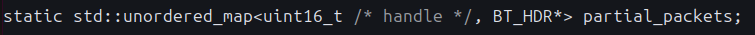

Where each entry is of a specific type struct : `BT_HDR`

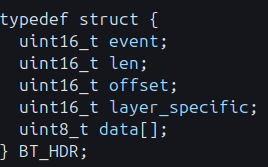

2. The second part is the handler when the incoming packet is the continuation of a packet entry that is already inside the map. The function received multiple packets with the max packet length allowed. While if at last, the remaining bytes of the packet are still more than what can be accomodated inside the entry, then the function just takes the bytes which can be put inside the map and just ignores the rest. This is why, it does this:


Where the developer has not check on the `packet->len` coming from the packet itself and assumes it is valid and `memcpy` it in the next line.

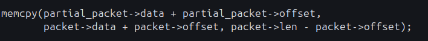

Due to the fact that `packet->len` and `packet->offset` is of type `uint16_t`. They are already vulnerable to Integer underflow.


```
A uint16_t (unsigned) cannot store negative numbers so instead of -1 it wraps around to the maximum value 65535 and can take up big numbers arbitrarily.

For ex:
Normal math: 0 - 1 = -1 
uint16 math: 0 - 1 = 65535
```

If the attacker crafts his payload carefully and lie about the actual length of his packet over the bluetooth connection, then he can easily exploit this `memcpy` function with size parameter set to a very large number like `65534`. This will copy our packet bytes into the memory regions where it was not supposed to be ever.

The core reason for this vulnerability was merely an oversight from the developer of the `bluetooth` service.

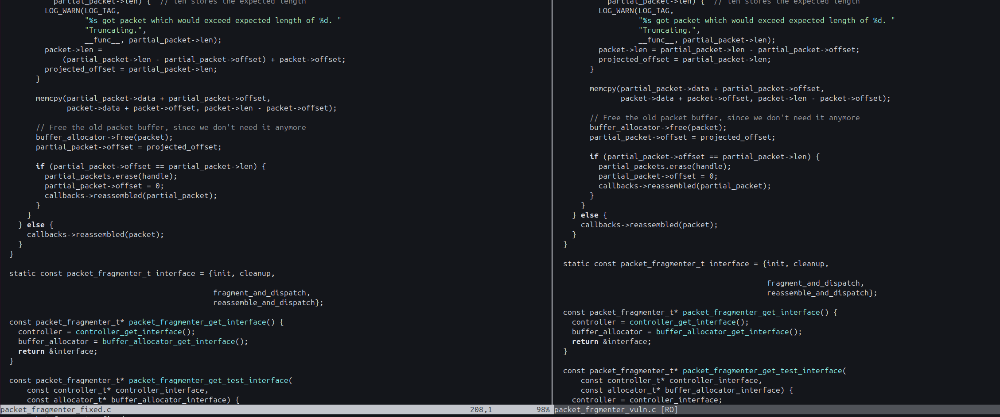

# Rooting my Lenovo Android 8.1.0 Tablet

This section focuses mainly on the process I followed to root my Lenovo Android 8.1.0 Tablet to be more comfortable with the POC development and can easily monitor the kernel logs and crashes in the device.

`You can skip this section if you have nothing to do with the POC development yourself.`

So as the BlueFrag vulnerability is mainly found in Android 8 or 9. I took my Lenovo tablet that had Android v8.1.0. To root it, the first and the easiest way I saw was using Magisk. But the problem with using this ROM patching tool is that if you make one wrong move in the flashing or flashed the wrong system image than the device, then your device will be nothing more than a brick. 

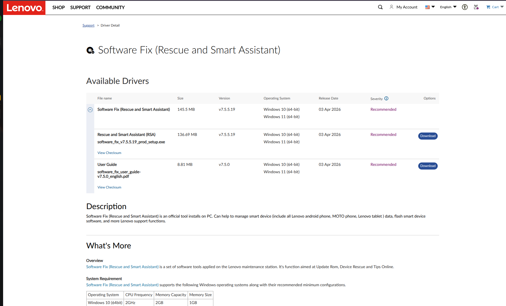

But I found a lifesaving software `LMSA (Lenovo/Motorola Smart Assistant)`. This software can give us the exact system image of the device by connecting it to the device via USB or using its `Serial Number`. This increased my trust on the system image I got from this software as it also had other details of my device listed inside it that it showed as soon as I entered my device's serial number in it. But there is just one catch: it only runs on Windows OS. :(

## The Magisk Flashing Pipeline

1. **Setup the Environment:** On the tablet, tap **Build Number** 7 times under _Settings > About_, then enable **USB Debugging** and **OEM Unlocking** in _Developer Options_.

2. **Patch the Boot Image:**
	- Copy the stock `boot.img` to the tablet.
    - Open the **Magisk App**, tap _Install > Select and Patch a File_, and pick your `boot.img`.
    - Transfer the generated `magisk_patched.img` from the tablet's local storage folder **back to your PC**.
        
3. **Unlock the Bootloader:**
    - Reboot into fastboot mode via PC terminal: `adb reboot bootloader`
    - Verify connection: `fastboot devices`
    - Unlock the device: `fastboot flashing unlock` or `fastboot oem unlock`
        
4. **Flash & Reboot:**
    - Flash the patched image from your PC: `fastboot flash boot magisk_patched.img`
    - Reboot the target: `fastboot reboot`

>  **Bootloop Recovery:** If the device loops at startup, force it back into fastboot mode (`Power + Vol Down`) and flash the original backup image to restore it completely: `fastboot flash boot boot.img && fastboot reboot`


# Target Verification: Confirming the Bug in the Binary

The first step in writing any $N$-day exploit is verifying that the vulnerability actually exists on your specific target device. Skipping this step means risking hours of exploit development on a patched system.

I started by reviewing the `Android source code` via the Android Code Search repository. By tracking the timestamp of Google's official patch, I was able to sift through the commits to locate the vulnerable code and identify exactly which branch it lived in.

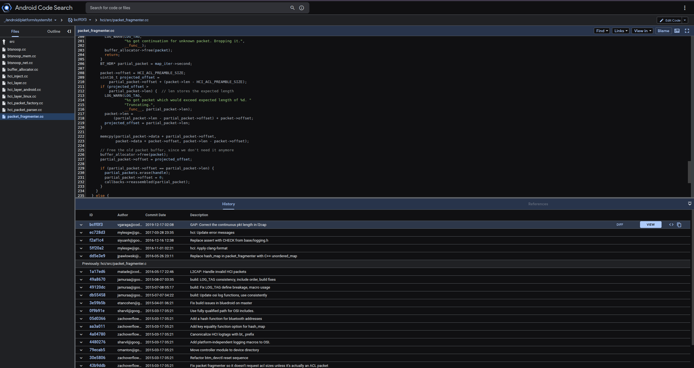

Next, I needed to check the security patch level of my target tablet to see if its BlueDroid-based Bluetooth service was susceptible. Using ADB, I pulled the build properties:

`adb shell getprop ro.build.version.security_patch -> 2019-03-05`.

This patch date strongly suggested the device was vulnerable to BlueFrag. However, to be absolutely certain, I wanted to analyze the compiled library itself.

First, I grabbed the PID of the Bluetooth service using `pidof com.android.bluetooth` to identify the paths of the core communication libraries.

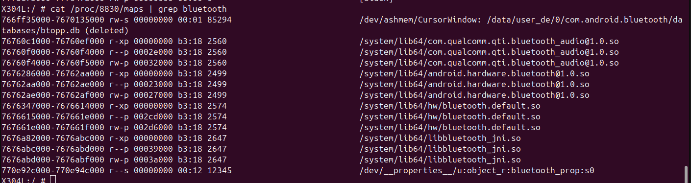

Then, I pulled the target binary directly from the device to my local machine:

`adb pull /system/lib64/hw/bluetooth.default.so ./`

I opened the .so binary in IDA Pro and navigated to the reassemble_and_dispatch function. To make the decompiled pseudocode cleaner and easier to analyze, I imported the relevant local structs directly from the Android source code.

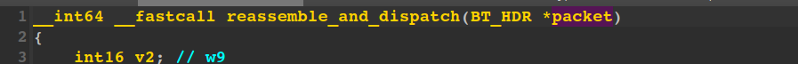

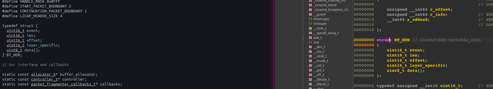

Applying these local types made the underlying logic much easier to read. 

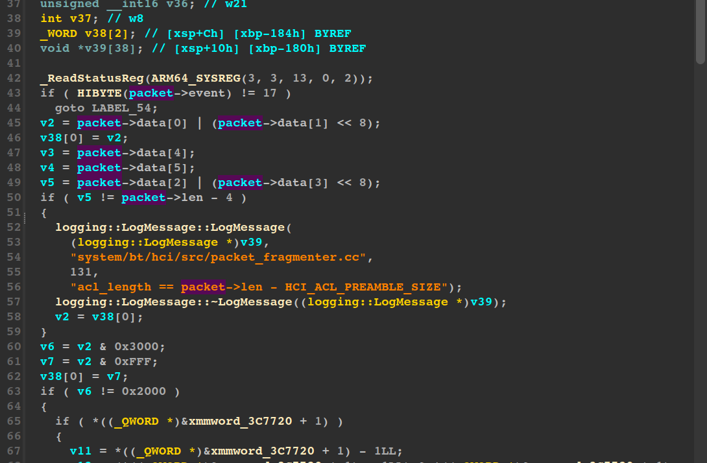

Sure enough, the vulnerable memcpy and integer underflow were glaringly obvious. The bug was definitively present in our device's Bluetooth daemon.

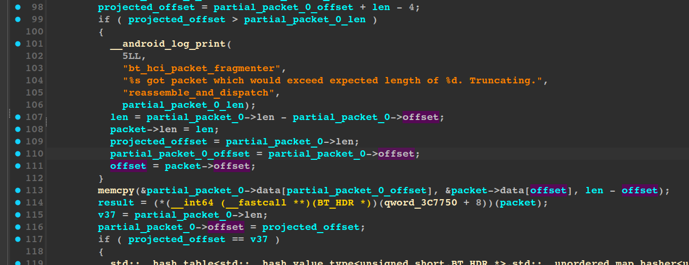

# Weaponizing the Bug: Crafting the Malicious Payload

Now it is time to trigger the vulnerability. I started by creating a dummy `Hello Server` Python script to observe how the device communicates with my PC upon connection, and to confirm whether it hits the vulnerable `reassemble_and_dispatch` function. For deeper analysis, I enabled the `BT HCI Snoop Log` on the device to dump all Bluetooth communication packets into a file.

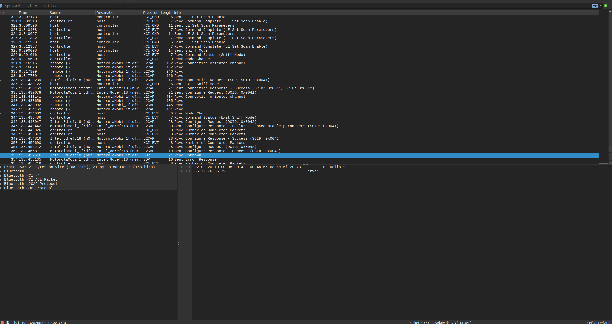

The capture above shows our message transferring from the PC to the device, interleaved with various noisy `HCI events` and background messages. These are likely verification checks or configuration data exchanges required before the actual message payload is delivered.

Next, we need to send the malicious packet to trigger the exploit. To verify the crash and observe the device's memory state during the attack, we must debug the Bluetooth process in real-time. I used `gdbserver`, provided by the `Android NDK Tools`.

```
Note: If you have the Android NDK installed, you can find the gdbserver binary at:

~/Android/Sdk/ndk/<version>/prebuilt/android-<architecture_type>/gdbserver/gdbserver
```

We push the binary to the device and attach it to the Bluetooth daemon process:

```
adb push gdbserver /data/local/tmp/gdbserver
adb shell

cd /data/local/tmp
chmod +x gdbserver
./gdbserver remote :5039 --attach <PID_OF_BLUETOOTH_PROCESS>
```

Before attaching gdb-multiarch to the bluetooth.default.so binary, we need to ensure GDB can resolve as many symbols as possible using standard Android libraries like libc.so and linker64.

Set up a new local directory structure mimicking the device's library hierarchy:

```
android_sysroot 
├── bin    
│   └── linker64
└── lib64  
    └── hw              
        ├── bluetooth.default.so
        ├── libc.so
        ├── libc++.so
        └── libhidlbase.so
```

Forward all traffic from the device's target port to your local machine for easier access:

`adb forward tcp:5039 tcp:5039`

Now, launch gdb-multiarch and configure the environment:

```
gdb > file LenovoTabLibs/android_sysroot/system/lib64/hw/bluetooth.default.so
gdb > set sysroot LenovoTabLibs/android_sysroot
gdb > target remote :5039
gdb > b reassemble_anbd_dispatch
```

Loading these symbols upfront makes it incredibly easy to set breakpoints by function name, saving us from having to manually calculate physical addresses using IDA offsets.

With the debugger attached, we can assemble the exploit. Based on our prior analysis, we know exactly what is required to trigger the vulnerable code path.

First, we send a `START_PACKET with handle | (0x2 << 12)`. This forces the device to create a new entry inside the unordered_map that handles incoming packets.

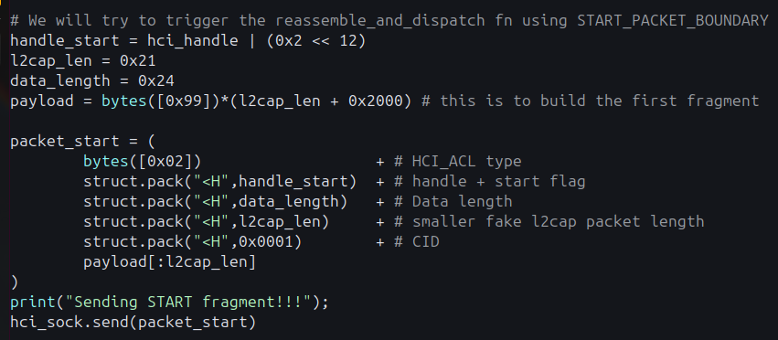

Once this initial packet is processed, the system calculates the required allocation:

`full_length = l2cap_length(0x21) + L2CAP_HEADER(0x4) + HCI_ACL_PREAMBLE_SIZE(0x4)`

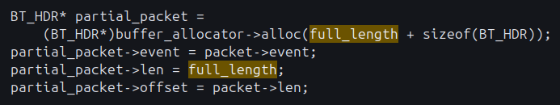

This allocates 0x29 bytes for the partial_packet we are about to receive for this specific map entry.

Next, we send the malicious CONTINUATION_FRAGMENT:

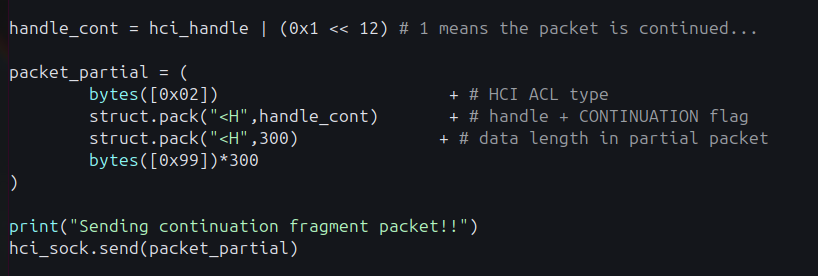

This has the `data_length  = 300 bytes`.

`projected_offset = partial_packet->offset(0x28) + (packet->len(300) - HCI_ACL_PREAMBLE_SIZE(0x4))`
`packet->len = partial_packet->len (0x29) - partial_packet->offset (0x28)`

- The projected_offset has to be more than the partial_packet offset to make sure that the execution of the code goes into extreme use-case where the memcpy function only wants to copy those bytes which it can and ignore the rest of the bytes.

Till now there has been no memory leak but after this:

`memcpy(partial_packet->data (0x29 bytes allocated) + partial_packet->offset (0x),packet->data + packet->offset (Will point to actual data sent in the packet), packet->len (0x1) - packet->offset (0x4))`

Because both `packet->len` and `packet->offset` are declared as unsigned `uint16_t data types` within the BT_HDR struct, subtracting 0x4 from 0x1 triggers an integer underflow. Instead of failing gracefully, the size parameter wraps around to `-3 (or 0xFFFFFFFFFFFFFFD in a 64-bit context)`. This forces memcpy to copy a massive payload into a tiny `0x29-byte buffer`, obliterating the adjacent heap memory.

Here is the complete Python exploit script used to trigger this:

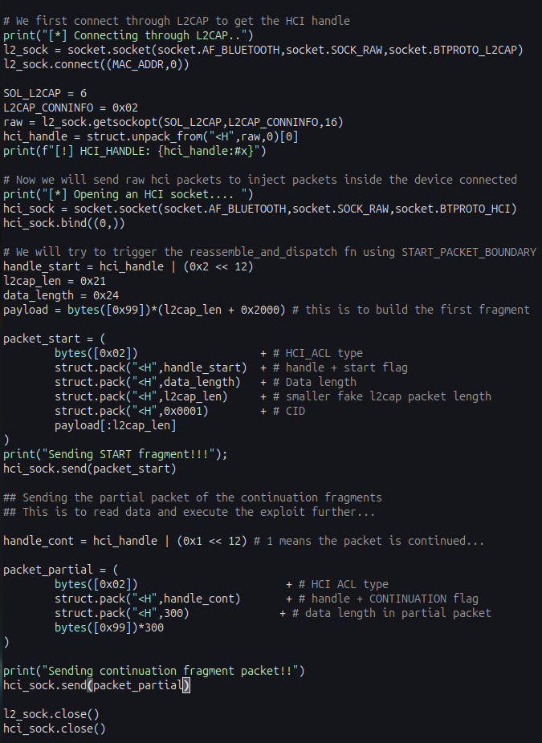

And the corresponding constant values extracted from the Android source code:

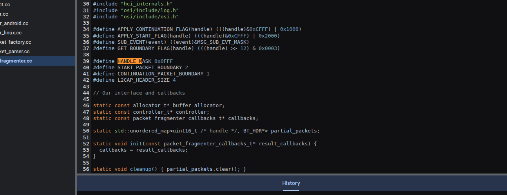

# GDB Analysis

With our GDB session primed, we can execute the Python exploit script against the target device.

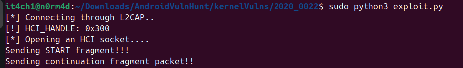

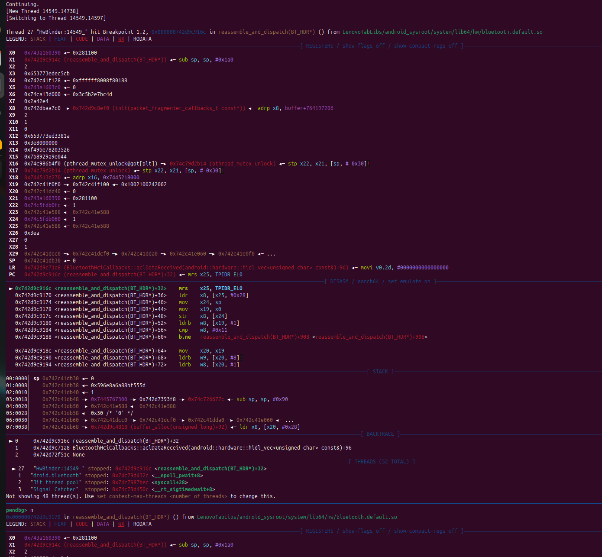

As soon as the script fires, our breakpoint is immediately hit inside the vulnerable `reassemble_and_dispatch` function during the processing of the START_FRAGMENT packet.

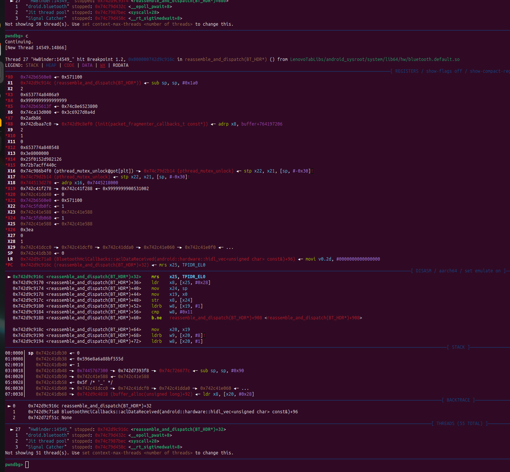

Continuing the execution, we can step into the `CONTINUATION_FRAGMENT logic block`. Looking at the registers, we can clearly see that our malicious packet data has been successfully loaded into the X4 register, perfectly positioned to be passed into the memcpy function and trigger the heap overflow.

# Patch Analysis : How did Google Fix it ?

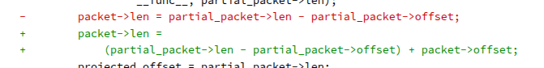

The fix adds `+ packet->offset` back into the truncated length. Since `packet->offset` is always `HCI_ACL_PREAMBLE_SIZE` (0x4) at this point, the result correctly restores the field to its expected `header + data` format. When `memcpy` later subtracts the same offset, the two cancel out cleanly leaving exactly the number of safe bytes remaining in the destination buffer.

What makes this patch notable is its precision. Google did not restructure the reassembly logic, add extra validation passes, or introduce new data structures. They identified exactly which invariant was violated and observed that `packet->len must always include the preamble` and restored it in the one place it was broken. The truncation path was the only location in the entire function where this format had been accidentally dropped.

# Beyond the Crash: Weaponizing BlueFrag

In this beginner N-Day blog, I have just tried to deliver the POC that will trigger the vulnerable code inside the device bluetooth driver. However, this can be easily turned into a working exploit.

The above POC ensures us that we can overflow the heap memory chunks. Here below is a proposed workflow for the exploit:

1. **Heap walking via L2CAP echo** : Send crafted L2CAP fragments with adjusted `mem_offset` to trigger a zero-length `memcpy`, causing uninitialized heap bytes to leak back inside the echo reply that can give us any leak inside the chunks.

2. **ASLR defeat via leaked bytes** :  Scan the leaked heap bytes to bypass ASLR using some function like free or simple function like printf.

3. **Heap grooming**: Flood the daemon heap with crafted packets of specific sizes to position a useful object directly adjacent to the allocation that the overflow will corrupt making the write land predictably. Debug to get offset if needed.

4. **Trigger the controlled overflow**: Send the malicious START + CONTINUATION packet pair to fire the `memcpy` underflow, overwriting the groomed adjacent object with controlled bytes from the continuation payload.

5. **Hijack control flow via ROP chain**:  Write a ROP chain that will jump execution to your malicious code and give RCE to the local system after the vuln is triggered.
