Have you ever been typing your credentials on your phone - maybe entering your bank PIN or a sensitive password; and felt like your screen was glitching ? The keys suddenly seem unresponsive and laggy, forcing you to tap them two or three times just to get a single number to register. Most of us would just brush this off, assuming our phone is getting old, the app is lagging, or our screen is just acting up. But what if it wasn't a glitch at all ? What if, in that exact moment, an invisible layer on your screen was quietly swallowing your taps, stealing your password right out from under your fingers while letting just enough touches through to keep you fooled? Welcome to the stealthy world of **Tapjacking**, the exact technique at the heart of a severe vulnerability known as CVE-2020-0014. Let's break down what this attack is and how it turns your own screen against you.


## What is TapJacking ? 

Tapjacking is one of the most common attacks in the mobile ecosystem due to its high success rate and low technical requirements. Just as the name suggests, it is the act of `hijacking` a user's taps. It occurs when a user believes they are interacting with a safe, visible application like entering credentials or clicking a harmless button; but their taps are actually being stolen or redirected by a hidden malicious application.
Now let’s see the working of Android TapJacking attacks: 

- `Android Z-order hierarchy`: We usually think of our phone screens in 2D, but Android renders interfaces in a 3D stack along the Z-axis. The home screen sits at the bottom, your active applications sit above that, and system prompts float at the very top. A Tapjacking attack exploits this by sneaking a malicious, invisible window right on top of the victim application.

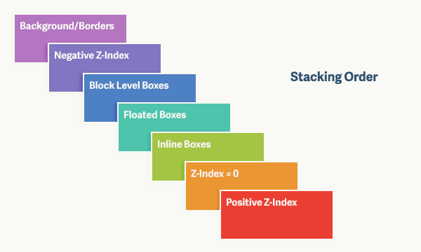

- `Visual deceptions`: The malicious app creates overlays that are entirely transparent making it invisible to the user or designs them to look like generic, harmless pop-ups. For example, it might show a fake game menu perfectly aligned over an invisible `Grant Permissions` prompt that might give sensitive permissions like `ACCESSIBILITY_SERVICES` to the malicious apps inside the device.

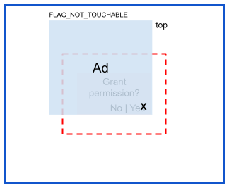

- `The MotionEvent`: When your finger touches the device’s screen, the device hardware generates a MotionEvent. The Android `WindowManager` catches this event and scans the whole order of the Z-hierarchy stack to figure out which app was clicked.

This generates two types of attacks that can be done through tapjacking: 

1. **Classic Tapjacking (Click-Through):** The malicious overlay uses the `FLAG_NOT_TOUCHABLE` flag. The user tries to click the fake "Play Game" button on the overlay, but the WindowManager passes the tap straight through the transparent layer, unintentionally hitting a hidden "Grant Permissions" button on the app underneath, granting the malicious app crucial permissions inside Android device.

2. **Touch Interception**:  The attacker ensures `FLAG_NOT_TOUCHABLE` is *absent*. When the user attempts to type their PIN into the legitimate banking app underneath, the invisible malicious layer intercepts the MotionEvent. It silently logs the keystrokes (stealing the PIN) while forcing the user to tap multiple times, creating the "glitchy" feeling mentioned earlier.

Normally, Android protects against this by forcing apps to ask for the highly restricted `SYSTEM_ALERT_WINDOW` permission. But what if an attacker found a way to create these invisible overlays without ever asking for permission ? That is exactly where Android Toasts and `CVE-2020-0014` enter the picture.

## What are Android Toasts ?

Android Toasts are a crucial feature of Android apps. If you have ever used an Android phone then you must have seen an Android toast for sure. They are simple a bubble of text that appears for a short time interval in the bottom of the apps generally. Like when you hit `Send Email` , the small bubble with the text `Message Sent` that appears on the screen is an Android Toast. Their main features were: 
- They were temporary
- They were unobtrusive and did not interfere with the user’s activity. they would just fade after sometime.
- They were untouchable: This was thought to be true by Google since 2020.

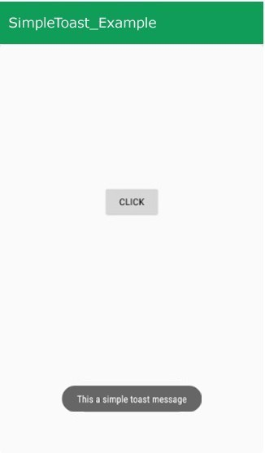

However Android Toasts are customizable to some extent like they can have different colors, different transparency and different time intervals. But these features of Android Toasts are very much harmless and incapable to doing attacks on their own.

Because of these harmless and non-interactive features of Android Toasts , the Android operating system grants them a special privilege. Unlike other overlays, an app can display a Toast *without* needing to ask the user for the highly restricted **"Draw over other apps"** permission (technically known as `SYSTEM_ALERT_WINDOW`).

To make sure this privilege isn’t abused, the OS strictly enforces specific window flags on Toasts - `FLAG_NOT_TOUCHABLE` and `FLAG_NOT_FOCUSABLE`. These flags are the digital equivalent of a `Look, But Don't Touch` sign. They tell the system that if a user taps on a Toast, the touch should pass straight through it to whatever app is running underneath and the Toast will never intercept the touch of the user.

## CVE-2020-0014

For years, Google treated Toasts entirely different from other windows and overlays. Android exempted them from the `SYSTEM_ALERT_WINDOW` permission due to their non-interruptive and non-interactive nature. The Android OS trusted that the apps will use `TYPE_TOAST` window type for harmless visual notifications.

The vulnerability identified in CVE-2020-0014 arises from a critical oversight in Android's `WindowManager`. When an application manually constructed a custom `TYPE_TOAST` window, the system failed to properly sanitize the window's layout parameters to enforce the un-clickable state of toasts.

- **The Missing Enforcement:** Normally, a Toast should inherently possess the `FLAG_NOT_TOUCHABLE` flag to ensure that any physical taps pass straight through to the app below. However, instead of the Android system forcibly hardcoding this restriction at the OS level, it blindly trusted the layout parameters provided by the application. 

- **The Exploitation:** An attacker could manually construct a custom `TYPE_TOAST` window—often using Java reflection techniques to bypass standard API restrictions—and deliberately omit or remove the `FLAG_NOT_TOUCHABLE` attribute. As a result, this custom window suddenly gained the ability to accept and intercept touch events, allowing the attacker to swallow the user's taps.

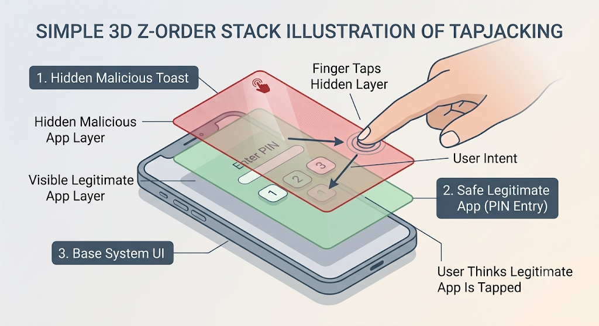

- **The Stealth Factor:** Because this malicious overlay was technically still classified by the system as a standard Toast, it completely bypassed the highly restricted `SYSTEM_ALERT_WINDOW` permission requirement. The attacker could stretch this invisible Toast across the entire screen, and neither the Android OS nor the user would flag it as suspicious.

## Working POC : CVE-2020-0014 

The poc exploit for the Stranghogg 2.0 vulnerability is documented here:

[Poc Code](https://github.com/it4ch1-007/POC_CVE_2020_0014)

For reproducing this vulnerability, I have used a Lenovo Tablet with Android version 8.1 affected by this bug according to 

[d885c3279f3fecb2c08e382c733a440113dae644 - platform/frameworks/base - Git at Google](https://android.googlesource.com/platform/frameworks/base/+/d885c3279f3fecb2c08e382c733a440113dae644)<!-- {"preview":"true"} -->

There isn't much we have to do to turn this vulnerability into a working exploit chain. We will use Android Toasts to hijack the taps a user makes on the screen of another application; in this case, a DummyLogin App I created to test the POC. To modify the Toast's core flags, we will use Java Reflection to configure them directly through our malicious app.

Java Reflection is a mechanism that allows a Java program to inspect and manipulate classes, methods, and fields at runtime. In Android exploit development, Reflection is frequently used to bypass compile-time visibility restrictions (like private fields or @hide APIs). This allows us to access and modify hidden system components that the OS usually prevents developers from touching.

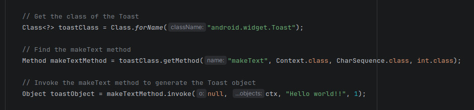

First we use this technique to build up an Android Toast with these configuration:

```
1. setGravity(Gravity.FILL) -> This expands the toast to fill up the whole screen of the device.
2. setAlpha(0) -> This will make the Toast invisible to the user.
3. setOnTouchListener() -> This sets up the handler function for all taps the user makes on the screen. It listens to the taps and extracts their exact X and Y coordinates.
```

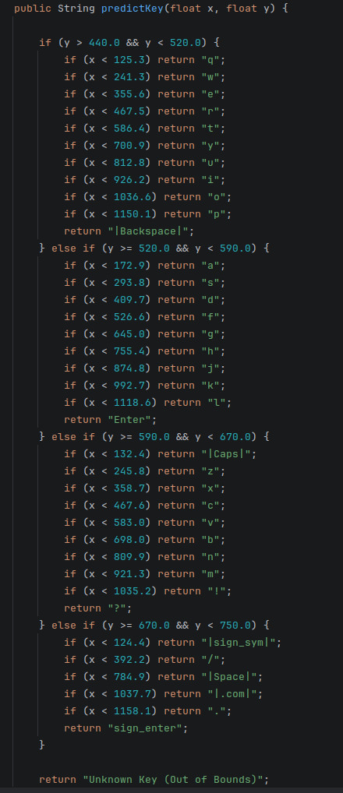

- Note: I hardcoded the keyboard layout of my device inside the `predictKey` function to get precise key stroke pressed acording to the X and Y coordinate of the user tap.

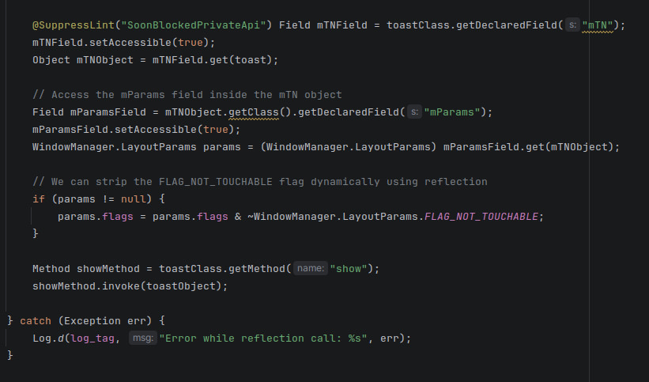

The crucial modification of the Toast's flags happens next, using the hidden mTN object (the TN or Transient Notification class inside Toast) and Android's WindowManager.LayoutParams API. We strip the `FLAG_NOT_TOUCHABLE` flag from the Toast. This forces it to behave differently than standard Android overlays, which Google explicitly designed to be untouchable to prevent exactly this kind of UI redressingbut apparently forgot to apply the same to Toasts :p.


With the core of the POC code ready, let’s see it in action:

[](https://www.youtube.com/watch?v=PzSPXnxtHPs)

This demonstration used a simple dummy login app. However, imagine this exact attack being executed by a malicious app running in the background while you open your banking or digital wallet app. It would silently log your passwords and PINs, giving an attacker full access to exploit your accounts.

## Real world Impact

### 1\. Invisible Keylogging
Unlike standard keyloggers that require root access or Accessibility permissions, a touch-intercepting Toast operates completely silently in the background. When a user opens a banking app to enter their PIN or password, the invisible overlay captures the raw MotionEvent coordinates first. The attacker maps those coordinates against standard keyboard layouts to steal credentials in real time.

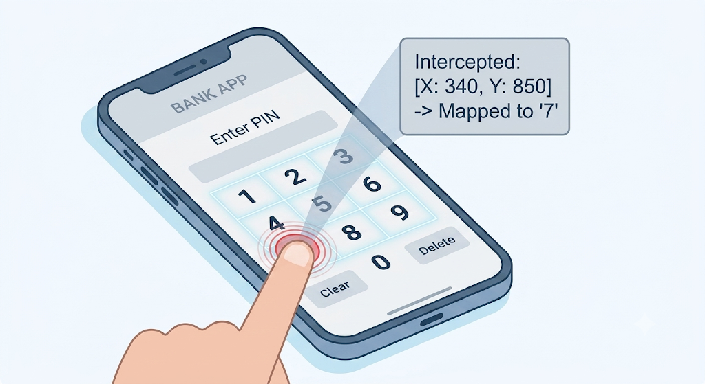

### 2\. Bypassing Two-Factor Authentication (2FA)
Financial apps often rely on SMS OTPs or PIN inputs as a second factor of authentication. Because this attack captures raw touch positions directly over the keypad area, it logs 2FA PINs as the user types them, completely neutralizing the defense offered by two-factor authentication.

### 3\. Exploitation by Modern Android Malware
Weaponizing overlays is a core tactic used by major Android Banking Trojans:
* **Albiriox (The Stealth ODF Mastermind):** Emerging in late 2025 as a highly sophisticated Malware-as-a-Service (MaaS), Albiriox targets hundreds of global banking and crypto apps. Its most dangerous feature is its "Black Screen" overlay mode. The malware drops an opaque, zero-brightness screen over the device, making the victim think their phone has gone to sleep or frozen. While the screen appears dead to the user, the malware is actively opening the banking app and authorizing transfers underneath.

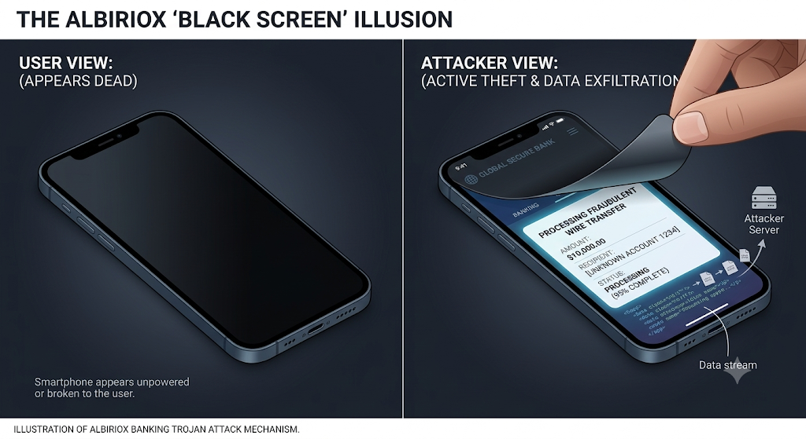

* **Vultur & Anatsa:** These advanced trojans take UI redressing a step further. They use keylogging overlays to steal PINs, but they also incorporate remote screen-streaming. Because they hijack the screen interactions directly at the presentation layer, they completely bypass multi-factor authentication (MFA) and device fingerprinting, as the bank's servers see the transaction originating from the user's physical, trusted device.

## The Patch

To fix CVE-2020-0014, Google had to move the security enforcement from the untrusted client application down to the trusted Android system layer. As seen in the source code patch, the WindowManager's DisplayPolicy was updated to explicitly sanitize the layout parameters whenever an app attempts to add a `TYPE_TOAST` window.

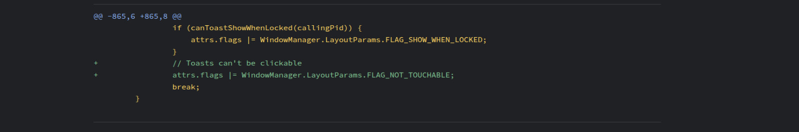

This single line of code uses a bitwise OR operator to forcibly inject the `FLAG_NOT_TOUCHABLE` attribute into every Toast window. Because this override happens deep inside the Android OS right before the window is drawn, it renders the `client-side Java Reflection exploit` completely useless. No matter what flags a malicious app tries to submit, the OS overrides them and ensures the Toast remains entirely unclickable solving the issue of TapJacking through Android Toasts.

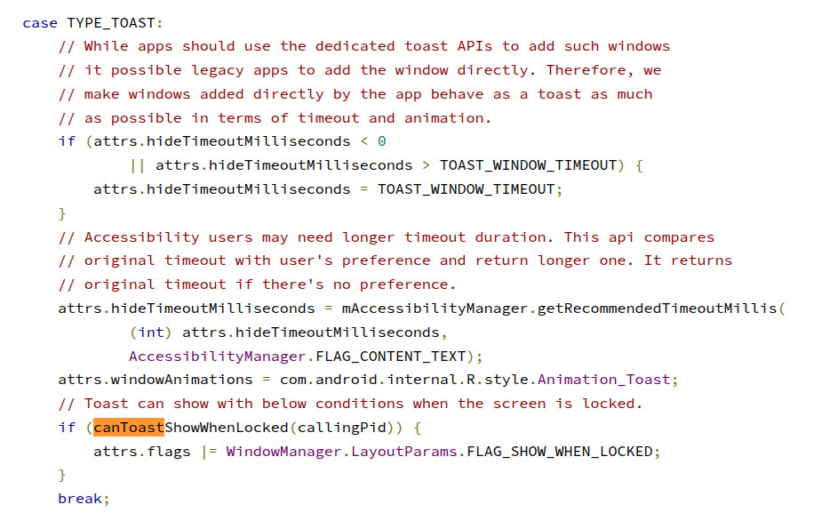
*Toasts Handling Before Patch*

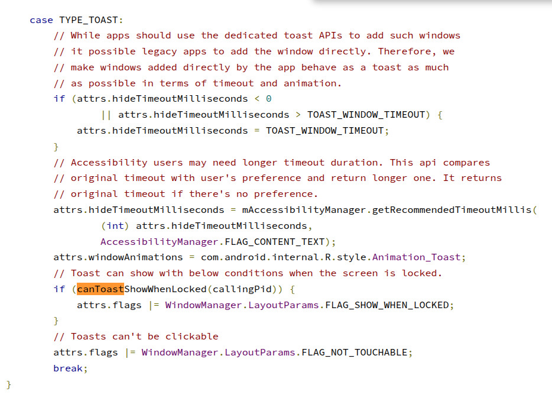
*Toasts Handling After Patch*

## Conclusion

CVE-2020-0014 showed us how a harmless, everyday feature of our mobile phones - a simple Toast message, could be weaponized into an invisible keylogger. While Google and app developers have built powerful shields against TapJacking, the constant evolution of mobile trojans and spywares proves one simple statement I recently heard in a movie: 
`Doveryay, no proveryay!!` - **Trust, But Verify**
