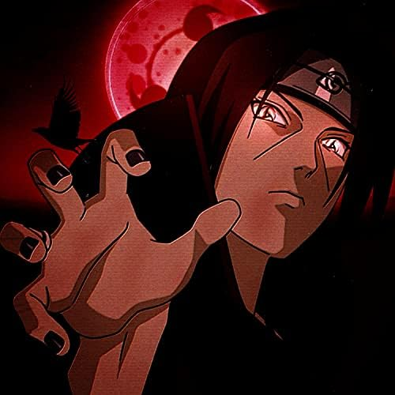

---
# the default layout is 'page'
icon: fas fa-info-circle
order: 4
---

  

I am a cybersecurity enthusiast with a strong background in the field of Android Security. Being a Reverse Engineer and CTF Player at one of the top CTF teams in the world `InfoSecIITR`, I have been exploring the field of Malware Analysis and Reverse Engineering honing my skills through practical challenges. This has not only deepened my knowledge about different attack vectors but also gave me deep understanding of defense mechanisms against new malwares and exploits.

  

Apart from security, I have been involved in Low-level development using modern languages like Rust,C,C++ and Go. Programming in these languages has helped me to write efficient and high performance code and tackle daily life programming challenges.

InfoSecIITR has also helped me in integration with various security projects like Modder_exe,Dissectix and Cobra that have helped me learn and explore more in the fields of Windows Internals and Rust Development. Working on these projects has also helped me to get a comprehensive understanding of Operating Systems and Kernel Programming (exploitation too :P).

In the field of cybersecurity, there is actually no limit, as soon as a software is developed thousand ways are there to exploit it , but if we can find those thousand ways we can surely find the one way to defend it.

`#REV4LYF`

